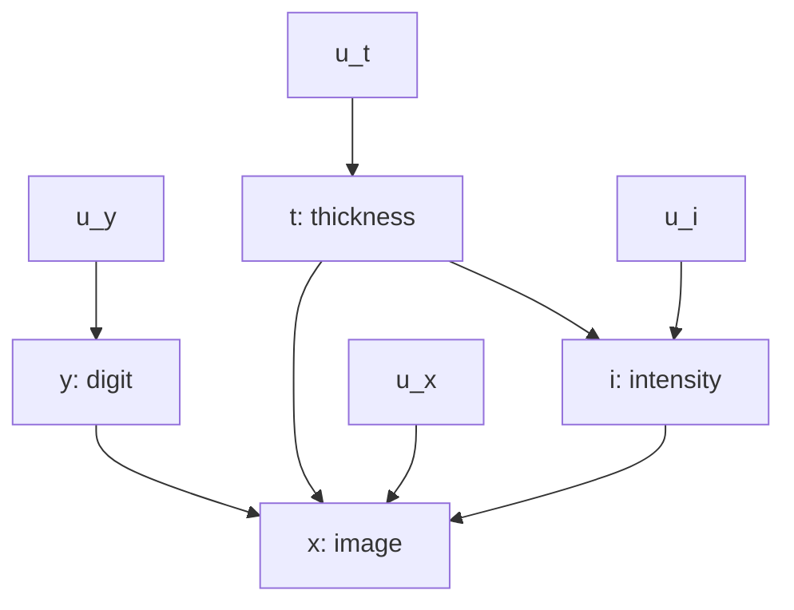
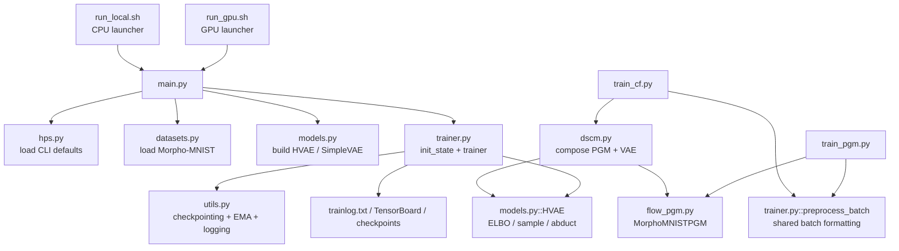
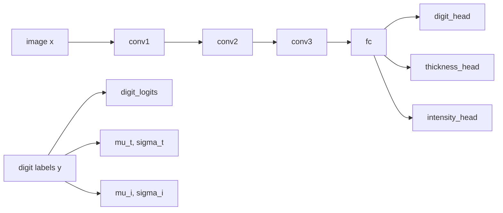
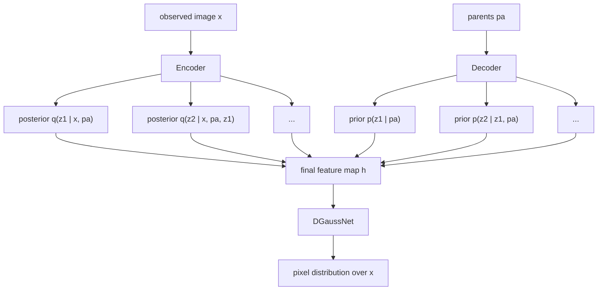
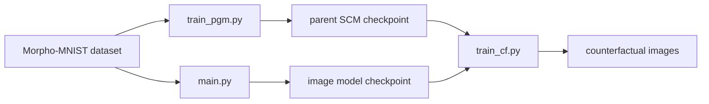

# `causal-genx` Documentation

This document explains how the **pure JAX** implementation in `causal-genx/` maps onto the paper
[*High Fidelity Image Counterfactuals with Probabilistic Causal Models*](../docs/Ribeiro2023_HighFidelityImageCounterfactuals.pdf).

The goal here is not just to summarize the paper. The goal is to make the code-to-paper mapping explicit so you can tell:

- which class or script corresponds to which paper component
- which hyperparameters are shared with the paper
- where the JAX image path is intended to match the PyTorch implementation
- where the JAX port is still intentionally narrower than the original repository

## High-Level Picture

The paper has four major ideas:

1. learn non-image causal mechanisms for parent variables
2. learn a high-fidelity image mechanism with a hierarchical latent structure
3. abduct latent noise from an observed image
4. generate counterfactual images under interventions on parent variables

The JAX code keeps the same overall workflow. The image-model path is maintained as a
PyTorch-parity implementation for Morpho-MNIST, while the full repository scope is still
narrower than the original Torch/Pyro project:

- the image mechanism is implemented in JAX/Flax/NNX and mirrors the PyTorch HVAE path
- the Morpho-MNIST structured-variable model is implemented in JAX
- counterfactual composition is implemented in JAX
- the current port is centered on Morpho-MNIST as the main acceptance path

## Paper To JAX Map

| Paper concept | JAX file or class | What it does |
|---|---|---|
| Image mechanism, conditional HVAE | `src/models.py::HVAE` | Trains the image model and computes the ELBO |
| Hierarchical encoder | `src/models.py::Encoder` | Bottom-up inference network that produces latent statistics from `x` |
| Hierarchical decoder | `src/models.py::Decoder` and `DecoderBlock` | Top-down generative path conditioned on parents |
| Likelihood for images | `src/models.py::DGaussNet` | Discretized Gaussian image likelihood head |
| Abduction | `src/models.py::HVAE.abduct` | Recovers latent variables from observed `x` and parents |
| Counterfactual decoding | `src/models.py::HVAE.forward_latents` | Reuses abducted latents under new parents |
| Image training loop | `src/main.py` + `src/trainer.py` | Builds the model, optimizer, and training loop |
| Parent-variable SCM | `src/pgm/flow_pgm.py::MorphoMNISTPGM` | Structured-variable model for Morpho-MNIST parents |
| Deep SCM composition | `src/pgm/dscm.py::DSCM` | Combines PGM + image model for counterfactual queries |
| Counterfactual evaluation | `src/pgm/train_cf.py` | Minimal JAX counterfactual smoke/eval path |
| Hyperparameter presets | `src/hps.py` | Dataset-specific defaults and CLI flags |

## Exact Mapping By Paper Section

### Paper Section 3.1, Structural Causal Model

In the paper, the SCM splits into non-image parent variables and the image variable `x`.

In JAX, the Morpho-MNIST parent side is implemented in:

- `src/pgm/flow_pgm.py`
- `src/pgm/dscm.py`
- `src/pgm/train_pgm.py`

### Morpho-MNIST Graphical Model

This is the Morpho-MNIST structural causal graph used by the paper and mirrored by the
JAX port:



Paper interpretation:

- `y` is the digit identity
- `t` is thickness
- `i` is intensity
- `x` is the rendered image

The causal factorization is:

- `y := f_y(u_y)`
- `t := f_t(u_t)`
- `i := f_i(t, u_i)`
- `x := f_x(i, t, y, u_x)`

JAX implementation mapping:

- `y`, `t`, `i` are handled by `src/pgm/flow_pgm.py::MorphoMNISTPGM`
- `x` is handled by `src/models.py::HVAE`
- composition for interventions and counterfactuals is handled by `src/pgm/dscm.py::DSCM`

### Paper Section 3.2, Conditional HVAE

The paper describes a hierarchical image model with:

- an encoder that infers latent variables from an observed image
- a decoder that conditions on parent variables
- a likelihood model over image pixels

In JAX, that maps directly to:

- `src/models.py::Encoder`
- `src/models.py::Decoder`
- `src/models.py::DGaussNet`
- `src/models.py::HVAE`

The JAX training objective in `HVAE.__call__` is:

- `nll` from `DGaussNet.nll`
- `kl` from the decoder hierarchy
- `elbo = nll + beta * kl`

That is the same paper-level ELBO structure, just written in JAX/Optax terms.

The Morpho-MNIST image model is also kept aligned with the original PyTorch code at the
implementation level:

- morphomnist residual blocks use GELU activations
- encoder downsampling uses average pooling for integer downsample rates
- decoder prior, posterior, convolution, and `z_proj` weight scaling follows the PyTorch HVAE
- `q_correction` is disabled by default unless `--q_correction` is explicitly passed
- `z_max_res` controls which decoder blocks are stochastic
- `bias_max_res` defaults to `64`, matching the PyTorch CLI default
- the discretized Gaussian likelihood clamps only the minimum logscale, matching PyTorch
- the free-bits KL reduction follows the PyTorch reduction order

### Paper Section 3.3, Latent Mediator and Abduction

The paper’s counterfactual logic keeps abducted noise fixed while changing parent variables.

In JAX:

- `HVAE.abduct(x, parents, ...)` infers the latent hierarchy from observed data
- `HVAE.forward_latents(latents, parents, ...)` decodes the same latent hierarchy under new parents
- `DSCM.counterfactual(...)` combines those two pieces with the parent SCM

That is the closest JAX equivalent of the paper’s abduct-then-intervene pipeline.

For conditional-prior image models, `HVAE.abduct(..., cf_parents=...)` implements the same
mixture-style latent counterfactual path as the PyTorch version: it combines posterior
statistics under observed parents with prior statistics under counterfactual parents before
decoding indirect and total-effect visualizations.

### Paper Section 3.4, Counterfactual Conditioning

The paper’s constrained counterfactual training uses a learned guidance signal and a Lagrangian objective.

In the JAX port, the current counterfactual path is centered on:

- `src/pgm/train_cf.py`
- `src/pgm/dscm.py`

This is currently more of a compact counterfactual composition / evaluation path than the full training procedure described in the paper.

## How The JAX Image Model Maps To The Paper

### `src/models.py::Encoder`

This is the inference network.

Paper meaning:

- approximate posterior `q(z | x, pa)`

JAX implementation:

- consumes `x`
- produces a resolution-indexed dictionary of activations
- those activations are consumed by the decoder to form posterior statistics at each hierarchy level

Important implementation detail:

- JAX uses `NHWC` layout
- the Torch version uses `NCHW`

So the same conceptual tensor path exists, but the array ordering is different. Inputs are
converted from dataset `NCHW` batches to JAX `NHWC` batches in `src/trainer.py::preprocess_batch`.

### `src/models.py::Decoder`

This is the hierarchical prior/posterior stack.

Paper meaning:

- the generative path over latent variables `z_1:L`
- the latent posterior used during abduction
- optional parent conditioning

JAX implementation details:

- `DecoderBlock.forward_prior(...)` computes the prior statistics at a given resolution
- `DecoderBlock.forward_posterior(...)` computes posterior statistics from `x`, `z`, and parents
- `Decoder.__call__(...)` iterates over the hierarchy from coarse to fine resolutions
- `parents` are injected by spatial broadcast and concatenation

This is the direct code-level equivalent of the paper’s hierarchical latent mechanism.

Parity-sensitive defaults:

- `q_correction = False`
- `z_max_res = 192`
- `bias_max_res = 64`
- `cond_prior` is enabled by the Morpho-MNIST run scripts

These values intentionally match the PyTorch scripts and CLI behavior.

### `src/models.py::DGaussNet`

This is the image likelihood head.

Paper meaning:

- discretized likelihood over pixel intensities

JAX implementation:

- predicts `loc` and `logscale`
- uses a discretized Gaussian NLL
- optionally handles RGB channel coupling, though the current Morpho-MNIST path is grayscale

This corresponds to the paper’s pixel likelihood layer rather than a generic decoder output head.

For PyTorch parity, the Morpho-MNIST default is:

- `x_like = diag_dgauss`
- `std_init = 0.0`

With `std_init = 0.0`, the logscale head uses random conv initialization, matching the PyTorch
path after the global conv-bias zeroing pass.

### `src/models.py::HVAE`

This is the central image model wrapper.

Methods:

- `__call__(x, parents, beta, rng)` computes the training loss
- `sample(parents, ...)` generates images from parent variables
- `abduct(x, parents, ...)` extracts latent variables from an observation
- `forward_latents(latents, parents, ...)` decodes counterfactual images

This class is the cleanest one-to-one mapping to the paper’s image mechanism.

### `src/models.py::SimpleVAE`

This is a compatibility alias of `HVAE` in the current JAX port.

In paper terms, this is not a separate conceptual model family. It exists mainly so the code can expose the same option surface as the Torch repository.

## How The JAX PGM Maps To The Paper

The paper’s Morpho-MNIST SCM uses causal mechanisms for:

- digit
- thickness
- intensity
- image

In the Torch repo, those structured variables are modeled with Pyro and flows.

In the JAX port, the Morpho-MNIST parent model is intentionally simpler:

- `src/pgm/flow_pgm.py::MorphoMNISTPGM`
- `src/pgm/train_pgm.py`

Current JAX implementation:

- digit is represented by learned logits over 10 classes
- thickness and intensity are represented by learned per-digit Gaussian parameters
- the predictor path uses a small CNN head

This is the main place where the JAX port is not a literal reproduction of the paper’s Pyro/flow machinery.

So the exact mapping is:

- paper SCM idea: preserved
- paper Morpho-MNIST flow parameterization: approximated
- paper counterfactual composition semantics: preserved at a high level

## How `DSCM` Maps To The Paper

`src/pgm/dscm.py::DSCM` is the composition object that takes:

- an image model
- a parent SCM

and turns them into a single counterfactual generator.

The key flow is:

1. parse observed parents from `pa`
2. compute counterfactual parents with `pgm.counterfactual(...)`
3. abduct latents from the observed image with `vae.abduct(...)`
4. decode with the counterfactual parents using `vae.forward_latents(...)`

That is the JAX version of the paper’s counterfactual pipeline.

## Training Call Graph

This is the practical code path for training and evaluation in the JAX port:



How to read it:

- `run_gpu.sh` is the shell entrypoint when you want the GPU defaults
- `main.py` is the main training entrypoint that constructs the image model
- `trainer.py` runs the ELBO optimization loop for the image mechanism
- `train_pgm.py` trains the Morpho-MNIST parent SCM
- `train_cf.py` loads the trained pieces and runs counterfactual composition

Important detail:

- `trainer.py` is not directly called by `train_pgm.py`, `train_cf.py`, `dscm.py`, or `flow_pgm.py` as a full training loop
- those files only reuse shared helpers such as `preprocess_batch` or model components
- the main trainer loop is only reached through `main.py`

## Complete Training Pipeline

The Morpho-MNIST pipeline is best understood as three separate stages that are run in order.
The image model is only one stage in the middle.

### Stage 1: Prepare the data and shared configuration

This stage is handled by the common configuration and preprocessing code:

- `src/hps.py` defines the Morpho-MNIST preset, the optimizer defaults, and the model architecture
- `src/datasets.py` loads Morpho-MNIST samples and returns batches with `x` and `pa`
- `src/trainer.py::preprocess_batch` reshapes the batch into JAX-friendly `NHWC` tensors and broadcasts parent variables across the spatial grid
- `src/utils.py::seed_all` sets the RNG seed and basic deterministic settings

What comes out of this stage:

- a resolved set of hyperparameters
- a ready-to-use dataset iterator
- a batch format that all later stages share

### Stage 2: Train the structured causal variables first

This stage is the parent-SCM tutorial: it shows how `src/pgm/train_pgm.py` learns the
Morpho-MNIST causal variables before the image model ever runs.

If you want the shortest mental model, think of it as:

1. read an image batch and its parent labels
2. predict digit, thickness, and intensity from the image
3. fit a simple probabilistic model for those parent variables
4. save the learned parent SCM for later counterfactual use

Run it like this:

```bash
cd causal-genx/src
python pgm/train_pgm.py --hps morphomnist --exp_name morphomnist_pgm
```

#### Model architecture

`train_pgm.py` trains a compact Morpho-MNIST parent SCM built from `MorphoMNISTPGM`.
The architecture has two parts:

- a small convolutional predictor that reads the image `x`
- a digit-conditioned parameter table that represents the parent distributions

The data flow is:



What this means:

- the CNN backbone turns `x` into a hidden representation
- `digit_head` predicts the digit class from that representation
- `thickness_head` predicts the thickness value
- `intensity_head` predicts the intensity value
- the learned parameter tables store the per-digit Gaussian statistics used in the causal
  sampling story

In equations, the model is trying to approximate:

$$
p(y, t, i \mid x)
$$

with the factorized parent-side structure:

$$
p(y, t, i \mid x)
=
p(y \mid x)\, p(t \mid x)\, p(i \mid x)
$$

while also learning the digit-conditioned prior tables:

$$
p(y) ,\quad p(t \mid y), \quad p(i \mid y)
$$

This is why the script optimizes both the predictor network and the per-digit Gaussian
parameters together.

What it learns:

- `digit`
- `thickness`
- `intensity`

What the code does:

1. loads Morpho-MNIST through `datasets.morphomnist(args)`
2. builds `MorphoMNISTPGM` from `src/pgm/flow_pgm.py`
3. converts the training batch with `preprocess_batch(...)`
4. runs an Optax `adamw` optimization loop
5. fits the parent predictors and the simple Morpho-MNIST causal parameters
6. writes checkpoints under `checkpoints/<hps>/<exp_name>/pgm/checkpoints`

The important point is that this stage trains the causal variables that the image model will later condition on.

#### Which parameters are optimized

`train_pgm.py` optimizes the entire parameter tree of `MorphoMNISTPGM`.

Concretely, the learned parameters are:

- $\texttt{digit\_logits} \in \mathbb{R}^{10}$
- $\mu_t \in \mathbb{R}^{10}$
- $\log \sigma_t \in \mathbb{R}^{10}$
- $\mu_i \in \mathbb{R}^{10}$
- $\log \sigma_i \in \mathbb{R}^{10}$
- the CNN / MLP weights in the predictor network:
  - `conv1`
  - `conv2`
  - `conv3`
  - `fc`
  - `digit_head`
  - `thickness_head`
  - `intensity_head`

The optimizer sees them all as one parameter set:

$$
\theta_{\text{pgm}} =
\{\texttt{digit\_logits}, \mu_t, \log \sigma_t, \mu_i, \log \sigma_i, \theta_{\text{cnn}}\}
$$

and updates them jointly with AdamW.

#### What the model is learning

For Morpho-MNIST, the parent SCM is a simple structural model over:

- `y`: digit class
- `t`: thickness
- `i`: intensity

The code in `src/pgm/flow_pgm.py::MorphoMNISTPGM` parameterizes this stage with:

- $\texttt{digit\_logits} \in \mathbb{R}^{10}$
- $\mu_t[y], \sigma_t[y]$ for thickness conditioned on digit
- $\mu_i[y], \sigma_i[y]$ for intensity conditioned on digit
- a small CNN predictor that reads the image $x$ and predicts the parents

The causal sampling story is:

$$
y \sim \operatorname{Categorical}\!\left(\operatorname{softmax}(\texttt{digit\_logits})\right)
$$

$$
t \sim \mathcal{N}\!\left(\mu_t[y], \sigma_t[y]^2\right)
$$

$$
i \sim \mathcal{N}\!\left(\mu_i[y], \sigma_i[y]^2\right)
$$

The learned parameter tables all have shape `(10,)`:

- `mu_t`: `(10,)`
- `sigma_t`: `(10,)` via `exp(thickness_logsigma)`
- `mu_i`: `(10,)`
- `sigma_i`: `(10,)` via `exp(intensity_logsigma)`

After indexing by a batch of digit labels, the selected values become batch-shaped scalars
with shape `(batch,)`.

The image `x` is then used as observational evidence to train the predictors and the
parameterized parent distributions.

#### What each training batch looks like

`train_pgm.py` loads Morpho-MNIST examples as dictionaries containing:

- `x`: the image
- `pa`: the parent vector

The helper `preprocess_batch(...)` converts them into JAX tensors. For the parent-SCM
stage, the important shape convention is:

- `x` becomes an `NHWC` image batch
- `pa` is expanded to match the spatial resolution so parent values can be broadcast when
  needed

Inside `train_pgm.py`, `pa` is unpacked as:

```python
thickness = pa[:, 0]
intensity = pa[:, 1]
digit = pa[:, 2:]
```

The digit label is represented as a one-hot vector, while `thickness` and `intensity` are
continuous values.

#### Objective function

The training loop builds `MorphoMNISTPGM`, then minimizes a composite loss:

$$
\mathcal{L}
= \mathcal{L}_{\text{digit}}
 + \mathcal{L}_{\text{thickness}}
 + \mathcal{L}_{\text{intensity}}
 + \mathcal{L}_{\text{nll}}
$$

where:

$$
\mathcal{L}_{\text{digit}} = \operatorname{CE}(p_{\text{digit}}(x), y)
$$

$$
\mathcal{L}_{\text{thickness}} = \operatorname{mean}\!\left((\hat{t}(x) - t)^2\right)
$$

$$
\mathcal{L}_{\text{intensity}} = \operatorname{mean}\!\left((\hat{i}(x) - i)^2\right)
$$

and the Gaussian negative log-likelihood terms for the digit-conditioned parent
distributions are:

$$
\mathcal{L}_{\text{nll}}(t)
= \frac{1}{2}\,\operatorname{mean}\!\left(
\left(\frac{t - \mu_t[y]}{\sigma_t[y]}\right)^2
+ 2 \log(\sigma_t[y] + \varepsilon)
\right)
$$

$$
\mathcal{L}_{\text{nll}}(i)
= \frac{1}{2}\,\operatorname{mean}\!\left(
\left(\frac{i - \mu_i[y]}{\sigma_i[y]}\right)^2
+ 2 \log(\sigma_i[y] + \varepsilon)
\right)
$$

$$
\mathcal{L}_{\text{nll}} = \mathcal{L}_{\text{nll}}(t) + \mathcal{L}_{\text{nll}}(i)
$$

So the total loss is effectively:

$$
\mathcal{L}
= \operatorname{CE}(p_{\text{digit}}(x), y)
 + \operatorname{MSE}(\hat{t}(x), t)
 + \operatorname{MSE}(\hat{i}(x), i)
 + \operatorname{NLL}(t \mid y)
 + \operatorname{NLL}(i \mid y)
$$

This is not a flow-based parent model in the JAX port. It is a deliberately simpler
structured-variable learner that captures the Morpho-MNIST causal variables well enough
for the downstream image model and counterfactual stage.

#### Optimization loop

`train_pgm.py` uses a straightforward supervised JAX training loop:

1. initialize `MorphoMNISTPGM`
2. extract the pure parameter tree with `nnx.state(...).to_pure_dict()`
3. create an `optax.adamw` optimizer with the Morpho-MNIST defaults
4. for each epoch:
   - iterate over the dataset in batches of size `--bs`
   - compute `L` and its gradients with `jax.value_and_grad`
   - apply the parameter update with `optax.apply_updates`
   - log the mean epoch loss
   - write a checkpoint

There is no validation split in this stage in the current JAX implementation. The goal is
to fit a usable parent SCM checkpoint for later use by the image model and counterfactual
stage.

#### What the stage produces

At the end of training, `train_pgm.py` writes:

- `params`
- `opt_state`
- `hparams`
- `epoch`

to `checkpoints/<hps>/<exp_name>/pgm/checkpoints`.

That checkpoint is the input to the counterfactual composition stage.

### Stage 3: Train the image mechanism conditioned on the parents

This is the image-model stage, implemented by `src/main.py` plus `src/trainer.py`.

If you want the shortest mental model, it is this:

- `main.py` prepares the run, builds the model, restores checkpoints, and hands control to the trainer
- `trainer.py` owns the actual optimization loop, evaluation loop, logging, EMA updates, and checkpoint saving
- `models.py::HVAE` is the image mechanism that is being optimized

The reason this stage comes after `train_pgm.py` is causal, not just engineering convenience:

- the parent SCM provides the variables that condition the image generator
- the image model learns how to render `x` from those parents plus hierarchical latents
- later, `train_cf.py` reuses both trained pieces for counterfactuals

#### What the image model learns

The trained model learns:

- a conditional generator for the image `x`
- a hierarchical latent hierarchy for abduction
- a discretized Gaussian likelihood over pixels
- a posterior / prior stack that can be reused for counterfactual decoding

#### The entrypoint flow in `main.py`

`main.py` is not the optimizer itself. It is the orchestrator that wires everything together.

The rough flow is:

1. seed all RNGs
2. create run directories
3. load Morpho-MNIST datasets
4. build `HVAE` or `SimpleVAE`
5. split the Flax NNX graph into parameters and structure
6. initialize optimizer state from one sample batch
7. optionally restore from a checkpoint
8. call `trainer(...)`

The relevant code path looks like this:

```python
seed_all(args.seed, args.deterministic)
args.save_dir = experiment_run_dir(args.ckpt_dir, args.hps, args.exp_name, "run")
datasets = morphomnist(args)

model = HVAE(..., rngs=rngs) if args.vae == "hierarchical" else SimpleVAE(..., rngs=rngs)
graphdef, _ = nnx.split(model, nnx.Param)

sample = datasets["train"][0]
sample = preprocess_batch(args, {k: sample[k][None] for k in sample}, expand_pa=True)
state, tx = init_state(model, args, sample, rng)

if args.resume and os.path.exists(args.resume):
    ckpt = load_checkpoint(args.resume, template=template)
    state.params = ckpt["params"]
    state.ema.params = ckpt["ema_params"]
    state.opt_state = ckpt["opt_state"]

trainer(args, graphdef, state, tx, datasets, writer, logger)
```

The important thing to notice is that `main.py` never performs gradient updates directly.
It only prepares the model and hands off the training loop to `trainer.py`.

#### The model architecture

The image model is a hierarchical conditional VAE:

- `Encoder` maps the observed image to multi-resolution activations
- `Decoder` walks top-down through the latent hierarchy
- `DGaussNet` turns the final features into a pixel likelihood

The conceptual graph is:



In code, that map is implemented by:

- `src/models.py::Encoder`
- `src/models.py::Decoder`
- `src/models.py::DGaussNet`
- `src/models.py::HVAE`

The model consumes JAX `NHWC` tensors. That is why `trainer.py::preprocess_batch` converts the dataset batches from `NCHW` to `NHWC` before they reach the network.

#### The objective function

The image-model trainer minimizes the positive ELBO-style objective returned by `HVAE.__call__`.

For a batch of images `x` and parent variables `pa`, the code implements:

$$
\mathcal{L}_{\text{image}}(x, pa)
= \mathcal{L}_{\text{nll}}(x, pa)
+ \beta \, \mathcal{L}_{\text{kl}}(x, pa)
$$

where:

$$
\mathcal{L}_{\text{nll}}(x, pa) = - \mathbb{E}_{q_\phi(z \mid x, pa)} \big[ \log p_\theta(x \mid z, pa) \big]
$$

and:

$$
\mathcal{L}_{\text{kl}}(x, pa)
= \frac{1}{HW C}
\sum_{\ell=1}^{L}
\mathrm{KL}\!\left(
q_\phi(z_\ell \mid x, pa, z_{<\ell})
\,\|\, 
p_\theta(z_\ell \mid pa, z_{<\ell})
\right)
$$

The implementation detail that matters is that `HVAE.__call__` returns a dictionary with:

- `elbo`
- `nll`
- `kl`

and `trainer.py` uses `out["elbo"]` as the optimization target.

In other words, the code minimizes the negative ELBO, even though the returned key is named `elbo` for historical consistency with the rest of the repository.

#### What `trainer.py` actually optimizes

The trainer optimizes three parameter sets jointly:

- the encoder weights
- the decoder weights
- the likelihood head weights

It also maintains two additional pieces of training state:

- Optax optimizer state, including AdamW moments
- exponential moving average weights for evaluation and visualization

The initialization step is:

```python
params = nnx.state(model, nnx.Param).to_pure_dict()
tx = make_optimizer(args)
opt_state = tx.init(params)
ema = EMA.init_from(params, args.ema_rate)
```

So the trainable parameters are not only the visible convolution weights in the VAE.
They include all learnable Flax NNX parameters inside `Encoder`, `Decoder`, and `DGaussNet`.

#### Batch preprocessing

Before the model sees a batch, `trainer.py::preprocess_batch` does three important things:

1. converts image tensors to `float32`
2. rescales pixel values to `[-1, 1]` if they appear to be in `0..255`
3. broadcasts parent variables across spatial dimensions when the decoder expects a dense context map

The shape transformation is:

$$
\text{NCHW} \rightarrow \text{NHWC}
$$

That is why the same dataset can be consumed by the JAX port even though the original PyTorch code uses channel-first tensors.

#### The training step

The heart of `trainer.py` is the JIT-compiled step function.

For a single device, the logic is:

```python
(loss, out), grads = jax.value_and_grad(_loss, has_aux=True)(params)
updates, candidate_opt_state = tx.update(grads, opt_state, params)
candidate_params = optax.apply_updates(params, updates)
new_ema = ema_decay * ema_params + (1.0 - ema_decay) * candidate_params
```

That is the full gradient update path:

- compute the loss
- differentiate it with `jax.value_and_grad`
- clip gradients and apply AdamW updates
- update EMA weights
- skip the update if the loss or gradients become non-finite

The code also records:

- `grad_norm`
- `update_skipped`
- `nll`
- `kl`
- `elbo`

#### TPU / multi-device path

When the run is on TPU with multiple local devices, the trainer switches to `jax.pmap`.

In that mode:

- the batch is sharded across devices
- gradients are averaged with `lax.pmean`
- finiteness is checked across all replicas
- the model state is replicated once and kept resident on-device

That is why `main.py` may adjust the global batch size when `--tpu_auto_scale` is enabled: the image-model stage is designed to run efficiently on multiple TPU cores without changing the mathematical objective.

#### A mini walkthrough of one epoch

An epoch in `trainer.py` looks like this:

1. fetch a batch from `datasets["train"]`
2. preprocess it with `preprocess_batch(...)`
3. warm up `beta` if `--beta_warmup_steps` is enabled
4. run one train step
5. accumulate epoch statistics
6. periodically log throughput and loss terms
7. periodically run validation on the EMA weights
8. save checkpoints when validation improves
9. write sample images and TensorBoard scalars

The validation side uses the EMA parameters rather than the raw training weights:

```python
out = eval_step_fn(eval_state.ema.params, batch, beta, batch_key)
```

That is important because the EMA weights usually produce cleaner samples and more stable reconstruction metrics.

#### Checkpointing and outputs

The image-model checkpoints are written under:

```text
checkpoints/<hps>/<exp_name>/run/checkpoints
```

The trainer saves:

- the current epoch
- the global step
- the best validation loss
- the live parameters
- the EMA parameters
- the AdamW optimizer state

This means the checkpoint is not just the network weights. It is the whole training state needed to resume the run exactly.

#### How to think about the image-model stage

The easiest interpretation is:

- `train_pgm.py` learns the parent variables
- `main.py` wires up the image model
- `trainer.py` fits the conditional image generator `p(x | pa)`

So this stage is the “rendering” half of the pipeline:

- the SCM decides the parent variables
- the HVAE learns how to realize those parents as an image
- later counterfactual code keeps the latent content fixed and changes the parents

That is the exact reason the image-model stage is separate from the structured-variable stage.

### Stage 4: Combine the trained pieces for counterfactuals

This stage is handled by `src/pgm/train_cf.py` and `src/pgm/dscm.py`.

What it does:

1. loads the trained parent SCM checkpoint from `--pgm_path`
2. loads the trained image-model checkpoint from `--vae_path`
3. merges both parts into a `DSCM`
4. takes an observed example `(x, pa)`
5. abducts latents from the observed image through `HVAE.abduct(...)`
6. computes counterfactual parents through `MorphoMNISTPGM.counterfactual(...)`
7. decodes the counterfactual image through `HVAE.forward_latents(...)`

This stage does not train a new generative model from scratch.
It uses the two trained models to answer the paper’s counterfactual query:

- keep the factual identity fixed
- intervene on the parent variables
- regenerate the image under the new causal conditions

### Where the launchers fit

The shell scripts in `src/` are just wrappers around the Python entrypoints:

- `run_local.sh` launches `main.py` on CPU
- `run_gpu.sh` launches `main.py` on GPU
- `run_tpu.sh` launches `main.py` on TPU

They are used for the image-model stage only.

`train_pgm.py` and `train_cf.py` are run directly with `python ...`, because they are separate pipeline stages rather than variants of the image-model launcher.

### End-to-end order

For Morpho-MNIST, the full pipeline is:

1. train the parent SCM with `src/pgm/train_pgm.py`
2. train the image model with `src/main.py`
3. run counterfactual composition with `src/pgm/train_cf.py`

If you want the shortest mental model:

- `train_pgm.py` learns the causal variables
- `main.py` learns the image generator conditioned on those variables
- `train_cf.py` combines both checkpoints and produces counterfactual images

### Artifact flow

The data and artifacts move through the pipeline like this:



Checkpoint layout:

- parent SCM: `checkpoints/<hps>/<exp_name>/pgm/checkpoints`
- image model: `checkpoints/<hps>/<exp_name>/run/checkpoints`
- counterfactual run outputs: `checkpoints/<hps>/<exp_name>/cf`

### Why the stages are separate

The separation is intentional:

- the parent SCM and the image model use different objectives
- the parent SCM can be trained and checked independently
- the image model can be retrained with different conditioning settings without touching the parent SCM
- counterfactual generation needs both pretrained pieces, so it is cleaner as its own step

That structure also matches the paper: learn the causal variables first, then learn the image mechanism, then compose them for counterfactual reasoning.

## Training Configuration In The JAX Port

The JAX defaults live in `src/hps.py`.

### Shared defaults

- optimizer: `AdamW`
- beta parameters: `[0.9, 0.9]`
- EMA rate: `0.999`
- learning rate warmup: `100` steps
- gradient clipping: `350`
- gradient skip threshold: `500`
- default beta penalty: `1.0`
- default batch size: `32`
- default visualization batch size: `32`

### Morpho-MNIST preset

The Morpho-MNIST preset in `src/hps.py` uses:

- `lr = 1e-3`
- `bs = 32`
- `wd = 0.01`
- `input_res = 32`
- `pad = 4`
- `z_dim = 16`
- `context_dim = 12`
- `widths = [16, 32, 64, 128, 256]`
- `x_like = "diag_dgauss"`
- `std_init = 0.0`
- `q_correction = False`
- `bias_max_res = 64`

This lines up closely with the paper’s Morpho-MNIST training setup.

### Training loop details

`src/trainer.py` uses:

- Optax `adamw`
- gradient clipping via `clip_by_global_norm`
- optional beta warmup
- EMA updates on every optimizer step
- periodic validation and checkpointing

The validation cadence matches the PyTorch trainer: validation/checkpoint/artifact generation
runs on the first epoch and then every `--eval_freq` epochs. The JAX code uses `epochs` as the
outer driver loop, while the paper reports steps / iterations.

### Important practical difference

The paper gives dataset-specific step counts, such as roughly:

- 1M steps for Morpho-MNIST
- 650K iterations for UK Biobank
- 210K steps for MIMIC-CXR

The JAX port’s actual run length is controlled by `--epochs`, not a paper-specific fixed step count.

So if you want paper-like training length, you need to set `--epochs` accordingly.

## Running The Image Model

Run scripts live in `src/` and activate the `med-jax` Conda environment if needed.

### CPU

```bash
cd causal-genx/src
bash run_local.sh morphomnist-jax-cpu
```

The CPU script forces the JAX CPU backend:

- `JAX_PLATFORMS=cpu`
- `JAX_PLATFORM_NAME=cpu`
- `CUDA_VISIBLE_DEVICES=""`

### GPU

```bash
cd causal-genx/src
bash run_gpu.sh morphomnist-jax-gpu
```

The GPU script uses:

- `--accelerator=gpu`
- `--precision=bf16`
- `--bs=32`
- `--viz_batch_size=32`

### TPU

```bash
cd causal-genx/src
bash run_tpu.sh morphomnist-jax-tpu
```

The TPU script uses:

- `PJRT_DEVICE=TPU`
- `--accelerator=tpu`
- `--precision=bf16`
- `--bs=32`
- `--viz_batch_size=32`

On multi-core TPU hosts, the trainer shards the global batch across local devices with `pmap`.
The global batch size must be divisible by the local device count.

### Batch Size Guidance

The PyTorch reference Morpho-MNIST scripts use batch size `32`. The JAX GPU and TPU scripts now
also default to `32` so quality comparisons are not confounded by batch-size changes.

For throughput experiments, you can still override the batch size:

```bash
bash run_gpu.sh morphomnist-jax-gpu-bs128 --bs=128
bash run_tpu.sh morphomnist-jax-tpu-bs128 --bs=128
```

When comparing visual quality against PyTorch, keep both `--bs` and `--viz_batch_size` aligned.

## Smoke Tests

The run scripts support a `smoke` argument that performs an early one-step feedback cycle:

```bash
cd causal-genx/src
bash run_local.sh morphomnist-jax-smoke smoke
```

Smoke mode adds:

- `--epochs=1`
- `--viz_freq=1`
- `--checkpoint_smoke_test`
- `--checkpoint_smoke_steps=1`
- `--eval_freq=1000000`

This exercises:

- dataset loading
- model construction
- one training step
- visualization
- checkpoint save
- checkpoint restore
- exact restored-state comparison

A passing smoke test logs:

```text
checkpoint_smoke_test=passed
```

The expected Morpho-MNIST smoke visualization shape with `--viz_batch_size=32` is:

- width: `1024` pixels
- height: `7616` pixels
- grid: `32` columns by `238` rows

This row layout matches the PyTorch visualization structure for the Morpho-MNIST conditional
prior path.

## Visualization Semantics

`src/utils.py::write_images` mirrors the PyTorch visualization:

- original images
- partial latent reconstructions
- a blank separator row
- samples at temperatures `0.1` through `1.0`
- counterfactual rows for direct effects
- indirect and total-effect rows when `cond_prior` is enabled
- difference rows computed against the reconstructed baseline

Visualization always uses at most `--viz_batch_size` examples from the batch. This prevents
GPU/TPU runs with larger training batches from producing visually incomparable grids.

Important note: existing image files in `results/` or `checkpoints/` were generated by whatever
code and hyperparameters existed at that time. Re-run the scripts after parity changes before
using artifacts for visual comparison.

## What Is Faithful And What Is Not Yet A Literal Match

### Faithful

- hierarchical image mechanism
- abduct-then-intervene counterfactual semantics
- ELBO-style training objective
- parent-conditioned decoding
- EMA checkpointing and sampling workflow
- Morpho-MNIST image-model architecture and loss defaults are aligned with PyTorch
- Morpho-MNIST visualization row layout and batch-size handling are aligned with PyTorch

### Simplified or currently ported differently

- Morpho-MNIST parent SCM is simpler than the Torch/Pyro flow version
- current counterfactual training script is a compact JAX path, not the full paper training stack
- the JAX port is currently centered on Morpho-MNIST rather than full paper parity across all datasets

### Runtime-level Differences To Expect

Even with implementation parity, exact bitwise equality is not expected between JAX and PyTorch
training runs because:

- PRNG streams are different
- convolution implementations and reduction order can differ by backend
- GPU/TPU `bf16` runs have different numeric precision from CPU `fp32`
- optimizer state updates are implemented by Optax rather than `torch.optim`

The intended target is algorithmic and artifact-structure parity with the PyTorch Morpho-MNIST
image path. For visual quality comparisons, use matched hparams, matched batch size, matched
visualization batch size, and freshly generated artifacts from both repos.

## File Guide

If you want the shortest route through the JAX implementation, read in this order:

1. `src/hps.py`
2. `src/models.py`
3. `src/trainer.py`
4. `src/pgm/flow_pgm.py`
5. `src/pgm/dscm.py`
6. `src/pgm/train_pgm.py`
7. `src/pgm/train_cf.py`

That order mirrors the conceptual flow of the paper:

1. choose the training preset
2. build the image model
3. train the image model
4. train the structured parent model
5. compose them into a counterfactual SCM

## Short Version

The JAX port keeps the paper’s causal story intact, but replaces the original PyTorch/Pyro implementation stack with JAX/Flax/NNX/Optax.

The exact code mapping is:

- `HVAE` = paper image mechanism
- `abduct` = posterior latent recovery
- `forward_latents` = counterfactual decoding
- `MorphoMNISTPGM` = current JAX parent SCM
- `DSCM` = image model + parent SCM composition

If you are reading the paper and the code side-by-side, `src/models.py` is the most important file to keep open.
