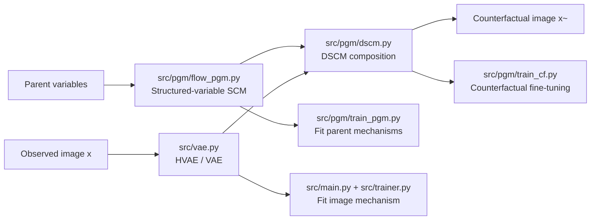

# `causal-gen` Documentation

This documentation is for the fork at [ghif/causal-gen](https://github.com/ghif/causal-gen).

This repository implements the code for the paper [*High Fidelity Image Counterfactuals with Probabilistic Causal Models*](docs/Ribeiro2023_HighFidelityImageCounterfactuals.pdf). The paper’s main idea is to treat image generation as one mechanism inside a larger structural causal model, then use that mechanism to answer interventional and counterfactual queries with high-fidelity images.

The codebase follows the same split as the paper:

- one part trains the causal mechanisms for non-image variables with probabilistic graphical models and flows
- one part trains the image mechanism with a hierarchical VAE
- one part combines the pieces into a full deep structural causal model and supports counterfactual generation
- one part optionally fine-tunes the image mechanism for stronger counterfactual conditioning

## Quick Start

1. Activate the Torch environment:

```bash
conda activate med-torch
```

2. Install dependencies:

```bash
pip install -r requirements.txt
```

3. Launch a training run from `src/`:

```bash
bash run_local.sh morphomnist_mps --accelerator mps
```

Swap `mps` for `cpu`, `cuda`, or `auto` depending on your machine.

## Compact Architecture



The diagram matches the paper’s separation between:

- the structured causal model for parents
- the image mechanism
- the combined deep SCM used for counterfactual queries

## Paper To Code Map

The paper’s Section 3.2 describes a conditional HVAE with an exogenous prior over the latent variables. In the code, this is implemented in `src/vae.py` and trained through `src/main.py` and `src/trainer.py`.

The paper’s Section 3.3 describes the latent mediator variant, where the latent hierarchy becomes a mediator conditioned on the parents. The repository implements the counterfactual composition logic for this setting in `src/pgm/dscm.py` and trains it in `src/pgm/train_cf.py`.

The paper’s Section 3.4 describes counterfactual conditioning training, where the image mechanism is fine-tuned with a learned predictor and a Lagrangian constraint. That training loop lives in `src/pgm/train_cf.py`.

The experiments in Section 4 are reflected in the supported datasets and default hyperparameter presets:

- Morpho-MNIST counterfactual mediation
- UK Biobank brain MRI counterfactuals
- MIMIC-CXR chest X-ray counterfactuals

## High-Level Architecture

The repository models a causal graph with two kinds of mechanisms:

- structured variables such as age, sex, disease, digit, thickness, and intensity are modeled with flows and small predictors
- the image variable `x` is modeled with a hierarchical VAE

In paper notation, the image mechanism is the difficult part. The code uses the following decomposition:

- `src/pgm/flow_pgm.py` learns the causal mechanisms for the non-image variables
- `src/vae.py` learns the image mechanism and its latent hierarchy
- `src/pgm/dscm.py` merges both sides into a single deep structural causal model

The image model is not a plain decoder-only generator. It is built to support:

- observational sampling
- abduction from an observed image
- counterfactual sampling under parent interventions

That is exactly the paper’s motivation: the model must produce plausible counterfactual images, not just unconditional samples.

## Main Components

### `src/main.py`

This is the main entrypoint for training the image mechanism.

What it does:

- parses hyperparameters from `src/hps.py`
- selects the accelerator with `--accelerator {auto,cpu,cuda,mps}`
- loads data through `src/train_setup.py`
- builds either `HVAE` or `VAE`
- creates an EMA copy of the model
- trains the image mechanism with `src/trainer.py`

This path corresponds most closely to the paper’s Section 3.2 implementation: the image mechanism is trained as a conditional generative model over `x` and its parents.

### `src/vae.py`

This is the core implementation of the hierarchical VAE used for the image mechanism.

Key classes:

- `Encoder`: bottom-up inference network that produces latent statistics from image evidence
- `Decoder`: top-down generative hierarchy that conditions on parent variables
- `DGaussNet`: discretized Gaussian likelihood head for image reconstruction
- `HVAE`: full model wrapper that exposes `forward`, `sample`, `abduct`, and `forward_latents`

Paper correspondence:

- Section 3.2: conditional HVAE with an exogenous prior
- Section 3.3: conditional HVAE with a latent mediator interpretation

Implementation details worth knowing:

- the decoder is hierarchical, not a single latent layer
- parent variables are injected at multiple resolutions through `parents`
- the latent path can be interpreted either as exogenous noise or as a mediator, depending on the training setup
- the likelihood is discretized and stable enough for high-resolution image training

### `src/simple_vae.py`

This file contains a lighter VAE variant that is kept for compatibility and simpler baselines.

Use it when:

- you want the single-latent version instead of the full hierarchical model
- you want a simpler baseline for debugging
- you want the image pathway without the full multi-scale hierarchy

### `src/pgm/flow_pgm.py`

This file implements the causal mechanisms for non-image variables.

It contains:

- `FlowPGM`: the main probabilistic causal model for UK Biobank-like structured variables
- `MorphoMNISTPGM` and `ColourMNISTPGM`: dataset-specific structured-variable models
- anticausal predictors used for supervised and semi-supervised training

Paper correspondence:

- these are the learned mechanisms for the parent variables in the SCM
- they are the components used to answer `do(...)` queries and to compute the parent-side part of the causal graph

The important conceptual point is that this file is not the image generator. It provides the causal context that the image generator conditions on.

### `src/pgm/dscm.py`

This file merges the image mechanism with the learned causal graph for the other variables.

Key pieces:

- `DSCM`: the combined deep structural causal model
- `vae_preprocess`: prepares parent variables to condition the image decoder
- `ukbb_preprocess`: converts UKBB parent variables to the conditioning format expected by the VAE

Paper correspondence:

- Section 3.3 and the SCM diagrams in the paper
- the “twin network” style composition used to produce counterfactual images

Conceptually, this is where the repository turns:

- observed image + observed parents
- into abducted latent noise
- then into counterfactual image + counterfactual parents

### `src/pgm/train_pgm.py`

This is the training loop for the non-image causal mechanisms.

It supports:

- supervised training of the PGM
- semi-supervised training
- anticausal auxiliary training

Why it matters in the paper:

- the paper assumes the non-image mechanisms are already learned or can be learned reliably
- this file is where those mechanisms are fit to data

### `src/pgm/train_cf.py`

This is the counterfactual training and evaluation pipeline.

It implements the paper’s Section 3.4 ideas:

- counterfactual conditioning
- learned predictors for parent variables
- mutual-information-inspired training
- constrained optimization with a Lagrange multiplier

What it does in practice:

- loads a trained predictor, PGM, and VAE
- builds a combined `DSCM`
- generates counterfactual images under sampled interventions
- optionally fine-tunes the VAE so the counterfactuals respond more strongly to interventions

This is the closest code match to the paper’s counterfactual fine-tuning discussion.

### `src/trainer.py`

This is the training loop for the image mechanism.

It handles:

- batch preprocessing
- gradient accumulation
- ELBO tracking
- EMA updates
- validation checkpoints
- TensorBoard summaries and image visualizations

The paper talks about training the image mechanism to maximize likelihood while respecting the causal parent structure. This file is where that training objective is actually optimized.

### `src/train_setup.py`

Shared training utilities:

- dataset loading
- optimizer and scheduler creation
- checkpoint directory management
- TensorBoard setup
- logging

### `src/utils.py`

Shared helper functions:

- seeding
- EMA
- normalization helpers
- image writing and plotting utilities

This repository now also uses `src/utils.py` to centralize accelerator selection. The training code can run on:

- `cuda`
- `cpu`
- `mps`
- `auto`, which picks CUDA first, then MPS, then CPU

## Datasets And Experiments

The repository currently supports the three paper-style settings:

- `morphomnist`
- `ukbb64` and `ukbb192`
- `mimic192`

These presets are defined in `src/hps.py`.

### Morpho-MNIST

This is the easiest place to start.

The paper uses it to demonstrate causal mediation effects, especially direct, indirect, and total effects. The code supports:

- digit
- thickness
- intensity

The relevant files are:

- `src/datasets.py`
- `src/pgm/train_pgm.py`
- `src/pgm/train_cf.py`
- `src/vae.py`

### UK Biobank Brain MRI

This mirrors the paper’s brain MRI example.

Variables include:

- MRI sequence
- age
- sex
- brain volume
- ventricle volume

The image mechanism is a larger version of the HVAE used for Morpho-MNIST.

### MIMIC-CXR

This is the chest X-ray setting from the paper.

Variables include:

- age
- sex
- race
- disease / finding
- chest X-ray image

The paper uses this setting to show that the method can work beyond toy data and can scale to a more realistic medical imaging scenario.

## How The Causal Story Works

The paper’s causal story is:

1. parent variables generate the image
2. the image mechanism must support abduction
3. counterfactuals are generated by keeping abducted noise fixed while changing parents
4. the counterfactual should stay visually plausible and preserve identity when appropriate

In code, that becomes:

- load a batch of observed parents and image
- encode the image to latent variables
- infer abducted noise
- intervene on parent variables
- decode the image again with the same abducted noise

That flow is implemented across:

- `src/vae.py`
- `src/pgm/dscm.py`
- `src/pgm/train_cf.py`

The paper distinguishes between:

- direct effects
- indirect effects
- total effects

The repository reflects this in the latent mediator counterfactual path, where the image can be generated under:

- factual parents with counterfactual mediator
- counterfactual parents with factual mediator
- counterfactual parents with counterfactual mediator

## Running The Code

### Environment

For Torch-based runs, use the `med-torch` conda environment.

```bash
conda activate med-torch
pip install -r requirements.txt
```

### Image mechanism training

From inside `src/`:

```bash
bash run_local.sh my_experiment --accelerator mps
bash run_local.sh my_experiment --accelerator cpu
bash run_local.sh my_experiment --accelerator cuda
bash run_local.sh my_experiment --accelerator auto
```

The launcher forwards extra arguments to `main.py`.

### Direct entrypoint

```bash
python main.py --exp_name my_experiment --accelerator mps
```

### Parent mechanism training

Use `src/pgm/train_pgm.py` with the same accelerator flag.

### Counterfactual fine-tuning

Use `src/pgm/train_cf.py` with the same accelerator flag.

## Outputs

The training scripts write the following kinds of artifacts:

- checkpoints under `checkpoints/`
- TensorBoard event files
- training logs
- visualizations such as reconstructed and counterfactual images

Common outputs include:

- `checkpoint.pt`
- `trainlog.txt`
- `events.out.tfevents...`
- `viz-*.png`

## Practical Notes

- The codebase is intentionally modular so the image mechanism can be trained independently from the rest of the SCM.
- The `--accelerator` option is a convenience layer over PyTorch device selection. It does not change the model architecture.
- `auto` is useful on mixed environments because it prefers CUDA when available, then MPS, then CPU.
- MPS support is best-effort and may still hit backend-specific PyTorch limitations on some operations.
- Some paper experiments use different model capacities and resolutions. The paper-to-code mapping is preserved, but the exact training recipe depends on the selected `hps` preset.

## Recommended Reading Order

If you are new to the repository, read the code in this order:

1. `src/hps.py`
2. `src/datasets.py`
3. `src/vae.py`
4. `src/trainer.py`
5. `src/pgm/flow_pgm.py`
6. `src/pgm/dscm.py`
7. `src/pgm/train_cf.py`

That mirrors the paper’s progression from causal assumptions to image generation to counterfactual evaluation.

## Short Summary

`causal-gen` is a practical implementation of the paper’s deep SCM framework for image counterfactuals. The non-image variables are handled by flows and probabilistic causal models, while the image variable is handled by a hierarchical VAE designed for abduction and counterfactual generation. The repository supports the paper’s main scenarios and now runs on CUDA, CPU, and MPS through an explicit accelerator flag.
