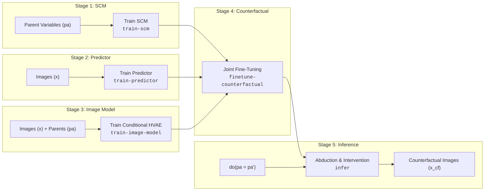

# Causal-GenX

[](https://github.com/google/jax)
[](https://github.com/google/flax)
[](#hardware-acceleration--benchmarks)
[](https://proceedings.mlr.press/v202/de-sousa-ribeiro23a.html)

**Causal-GenX** is a high-performance, native JAX/Flax framework for **causal generative image modeling and counterfactual generation**. It provides a pure JAX reimplementation and extension of the Deep Structural Causal Model (DSCM) paradigm introduced in [*High Fidelity Image Counterfactuals with Probabilistic Causal Models* (ICML 2023)](https://arxiv.org/abs/2306.15764).

Designed specifically for researchers and collaborators working on medical imaging and machine learning, Causal-GenX provides clean abstractions, strong multi-accelerator scalability (NVIDIA GPUs and Google Cloud TPUs), typed configuration schemas, and end-to-end reproducibility.

---

## Table of Contents

- [Key Highlights](#key-highlights)
- [Repository Architecture](#repository-architecture)
- [Getting Started](#getting-started)
  - [Environment Setup](#1-environment-setup)
  - [Configuration Validation & Preflight](#2-configuration-validation--preflight)
- [The 5-Stage Research Workflow](#the-5-stage-research-workflow)
  - [Workflow Stages Explained](#workflow-stages-explained)
  - [Running the Complete MorphoMNIST Pipeline](#running-the-complete-morphomnist-pipeline)
- [Supported Datasets & Domains](#supported-datasets--domains)
  - [MorphoMNIST (Reference Benchmark)](#1-morphomnist-reference-benchmark)
  - [PadChest (Clinical Chest X-Ray)](#2-padchest-clinical-chest-x-ray)
  - [CXR-RAIT (Fairness & Audit Benchmark)](#3-cxr-rait-fairness--audit-benchmark)
- [Inference, Interventions & Visualization](#inference-interventions--visualization)
  - [Command-Line Counterfactual Inference](#command-line-counterfactual-inference)
  - [Interactive Visualizer](#interactive-visualizer)
- [Hardware Acceleration & Benchmarks](#hardware-acceleration--benchmarks)
- [Collaborator Guide: Extending Causal-GenX](#collaborator-guide-extending-causal-genx)
  - [Adding a New Dataset](#adding-a-new-dataset)
  - [Running Tests & Parity Validation](#running-tests--parity-validation)
- [Deep Dive Documentation](#deep-dive-documentation)
- [Citation & References](#citation--references)

---

## Key Highlights

- **Pure JAX/Flax/Optax Ecosystem**: No legacy PyTorch/Pyro runtime dependencies during training or inference.
- **Extreme Throughput & Scalability**: 7× to 10×+ training throughput over earlier implementations, with first-class support for multi-device Google Cloud TPUs (e.g. TPU v6e) and NVIDIA GPUs (A100, H100, L4).
- **End-to-End Causal Pipeline**: Unified execution for tabular Structural Causal Models (SCM), image-to-parent predictors, hierarchical conditional VAEs (HVAE), counterfactual fine-tuning with Lagrangian constraints, and counterfactual abduction/inference.
- **Unified Typed CLI**: All workflows run through a single CLI (`scripts/run.py`) driven by validated YAML configuration contracts.
- **Cloud-Native Artifacts**: Built-in Orbax checkpointing, TensorBoard metric logging, and transparent Google Cloud Storage (GCS) artifact synchronization (`gs://...`).

---

## Repository Architecture

```text
causal-genx/
├── scripts/
│   ├── run.py                       # Single CLI entrypoint for all training & inference stages
│   ├── morphomnist_visualizer.py    # Interactive browser-based counterfactual inspection tool
│   ├── convert_cxr_weights.py       # TorchXRayVision DenseNet-121 Flax weight converter
│   └── stage_padchest_inputs.py     # Data staging utilities for clinical datasets
├── configs/                         # Modular YAML experiment configs (dataset, model, runtime)
│   ├── morphomnist_*.yaml           # MorphoMNIST configs (CPU, GPU, TPU v6e-4)
│   ├── padchest_*.yaml              # PadChest configs (CPU, TPU v6e-1)
│   └── cxr_rait_*.yaml              # CXR-RAIT audit configs (CPU, GPU)
├── src/                             # Core reusable library
│   ├── causal/                      # SCMs, parent predictors, and Deep SCM composition
│   │   ├── deep_scm.py              # DSCM abduction, intervention, and generation logic
│   │   ├── generic_scm.py           # Schema-driven structural causal models
│   │   ├── flow_scm.py              # MorphoMNIST parent SCM mechanisms
│   │   ├── image_parent_predictor.py# Predictor architectures (CNN, DenseNet)
│   │   └── cxr_rait_*.py            # CXR-RAIT specific causal specifications
│   ├── data/                        # Dataset providers, parent encodings, and split handlers
│   │   ├── morphomnist.py           # MorphoMNIST provider and digit transformations
│   │   ├── padchest.py              # Clinical PadChest loader and label encodings
│   │   ├── cxr_rait.py              # CXR-RAIT loader and metadata pipeline
│   │   └── conditioning.py          # Spatial parent broadcasting and feature encoding
│   ├── models/                      # Deep generative image mechanisms
│   │   └── image_vae.py             # Hierarchical VAE (HVAE), Encoder, Decoder, DGaussNet likelihood
│   ├── training/                    # Stage runners and optimization loops
│   │   ├── scm.py                   # Stage 1: SCM parameter optimization
│   │   ├── predictor.py             # Stage 2: Parent predictor training
│   │   ├── image_model.py           # Stage 3: Conditional HVAE ELBO training
│   │   ├── counterfactual.py        # Stage 4: Constrained counterfactual fine-tuning
│   │   └── inference.py             # Stage 5: Batch counterfactual inference & evaluation
│   ├── config.py                    # Strict YAML config schema parsing and validation
│   ├── runtime.py                   # JAX backend setup, device discovery, and preflight checks
│   └── utils.py                     # Orbax checkpointing, GCS mirroring, and TensorBoard logging
├── tests/                           # Complete test suite
│   ├── unit/                        # Unit tests for components, schemas, and staging
│   ├── contract/                    # Dataset and workflow boundary contracts
│   ├── integration/                 # Multi-stage runner and configuration integration tests
│   └── test_*_parity.py             # Numerical parity tests against PyTorch reference outputs
├── docs/                            # In-depth technical guides & implementation notes
└── backend/                         # Optional FastAPI/Cloud Run deployment service
```

---

## Getting Started

### 1. Environment Setup

Clone the repository and install dependencies matching your accelerator backend:

```bash
# Activate your virtualenv or conda environment
conda activate med-jax

# For CPU execution:
pip install -r requirements.txt

# For NVIDIA GPU (CUDA 12+):
pip install -r requirements-gpu.txt

# For Google Cloud TPU:
pip install -r requirements-tpu.txt
```

> **Note**: For local development and imports, ensure `PYTHONPATH=src` is set when running scripts directly, or invoke `scripts/run.py` which manages paths automatically.

### 2. Configuration Validation & Preflight

Before submitting long-running jobs or multi-host TPU allocations, validate your configuration schema and target hardware without loading full datasets:

```bash
# Validate config schema and output paths
python scripts/run.py train-image-model \
  --config configs/morphomnist_image_model.yaml \
  --dry-run

# Verify image model construction and generate a sample visualization
python scripts/run.py train-image-model \
  --config configs/morphomnist_image_model.yaml \
  --dry-run-image
```

---

## The 5-Stage Research Workflow

Causal generative modeling decouples tabular parent relationships, auxiliary predictors, and generative image mechanisms before composing them for counterfactual generation.



### Workflow Stages Explained

| Stage | Command | Purpose & Output Artifacts |
|---|---|---|
| **1. SCM Training** | `train-scm` | Fits the structural causal model over parent variables $p(\text{pa})$. Outputs learned parameters for prior distributions and structural equations. |
| **2. Parent Predictor** | `train-predictor` | Fits an auxiliary mapping $f(x) \to \text{pa}$ (CNN or DenseNet) used for classifier guidance and counterfactual validation. |
| **3. Image Model** | `train-image-model` | Optimizes the Hierarchical Conditional VAE ($p(x \mid z, \text{pa})$ and $q(z \mid x, \text{pa})$) using discretized Gaussian likelihoods and multi-scale latents. |
| **4. Counterfactual Fine-Tuning** | `finetune-counterfactual` | Loads checkpoints from Stages 1–3 and fine-tunes the image mechanism under Lagrangian constraints for high-fidelity counterfactuals. |
| **5. Inference & Sampling** | `infer` | Executes 3-step causal queries (Abduct $\to$ Intervene $\to$ Predict) to generate counterfactual image samples. |

### Running the Complete MorphoMNIST Pipeline

You can execute each stage sequentially using the provided reference configs:

```bash
# Stage 1: Fit MorphoMNIST parent SCM (digit, thickness, intensity)
python scripts/run.py train-scm \
  --config configs/morphomnist_scm.yaml

# Stage 2: Train image-to-parent predictor
python scripts/run.py train-predictor \
  --config configs/morphomnist_predictor.yaml

# Stage 3: Train conditional HVAE image model
python scripts/run.py train-image-model \
  --config configs/morphomnist_image_model.yaml

# Stage 4: Fine-tune counterfactual mechanism
python scripts/run.py finetune-counterfactual \
  --config configs/morphomnist_counterfactual.yaml

# Stage 5: Run counterfactual inference and evaluation
python scripts/run.py infer \
  --config configs/morphomnist_inference.yaml
```

---

## Supported Datasets & Domains

| Dataset | Modality & Resolution | Causal Variables / Parents | Available Architectures & Profiles |
|---|---|---|---|
| **MorphoMNIST** | Synthetic MNIST ($32 \times 32$ / $28 \times 28$) | `digit` (categorical), `thickness` (continuous), `intensity` (continuous) | Custom HVAE, CNN predictor; profiles for CPU, NVIDIA GPU, and TPU v6e-4 |
| **PadChest** | Clinical Chest Radiographs ($128 \times 128$) | `sex`, `projection`, `view_position`, `tb_status`, `infiltrates`, `pleural_effusion`, etc. | Deep HVAE decoder with spatial conditioning, TPU v6e-1 optimized pipelines |
| **CXR-RAIT** | Clinical Chest Radiographs ($224 \times 224$) | Demographic & radiographic audit attributes | Pretrained TorchXRayVision DenseNet-121 backbone ported to Flax |

### 1. MorphoMNIST (Reference Benchmark)
MorphoMNIST provides controlled, ground-truth morphological modifications on handwritten digits. Default dataset root points to `gs://medical-airnd/causal-gen/datasets/morphomnist` (or a local folder).

### 2. PadChest (Clinical Chest X-Ray)
PadChest models chest radiographs conditioned on demographic variables (`sex`, `age`) and acquisition parameters (`projection`, `view_position`).
- Checkpoints & samples: `checkpoints/padchest/`
- Context-17 sampling config: `configs/padchest_inference_context17.yaml`

### 3. CXR-RAIT (Fairness & Audit Benchmark)
CXR-RAIT benchmarks algorithmic fairness across sub-populations. It supports initializing the predictor from pretrained TorchXRayVision DenseNet-121 weights:
```bash
# Convert PyTorch weights to Flax NPZ format
python scripts/convert_cxr_weights.py

# Train with frozen or unfrozen pretrained DenseNet
python scripts/run.py train-predictor \
  --config configs/cxr_rait_predictor_pretrained_frozen.yaml
```

---

## Inference, Interventions & Visualization

### Command-Line Counterfactual Inference

Run inference using predefined YAML configs, or override parent interventions dynamically at runtime on the CLI:

```bash
# Sample from PadChest model under specific demographic & disease interventions:
python scripts/run.py infer \
  --config configs/padchest_inference_context17.yaml \
  workflow.parents.tb_status=1 \
  workflow.parents.sex=0 \
  workflow.latent_temperature=0.7 \
  workflow.num_samples=8
```

Output samples, comparison panels, and metrics are written directly to:
`checkpoints/<dataset>/<run_name>/inference/`

### Interactive Visualizer

For real-time counterfactual exploration, launch the interactive visualizer:

```bash
python scripts/morphomnist_visualizer.py
```
Open your browser to the printed local port to interactively adjust slider values for thickness, intensity, and digit class to observe real-time counterfactual reconstructions.

---

## Hardware Acceleration & Benchmarks

Causal-GenX is engineered for maximum throughput and hardware utilization across platforms.

### Performance Summary: JAX vs. PyTorch

| Platform | Workload & Batch Size | Legacy PyTorch | Native JAX/Flax | Speedup Ratio | Hardware & Notes |
|---|---|---:|---:|---:|---|
| **CPU** | Parent PGM (Batch Size 16) | 3,563 samples/s | **25,685 samples/s** | **~7.2×** | Controlled comparison on identical CPU |
| **CPU** | HVAE Image Training (Batch Size 32) | 17.1 samples/s | **179.4 samples/s** | **~10.5×** | JAX steady-state compiled execution |
| **GPU** | HVAE Image Training | 750.7 samples/s (A100) | **4,769.4 samples/s** (G4) | **~6.4×** | JAX compiled kernels & mixed precision |
| **TPU v6e-1**| HVAE Image Training (Batch Size 128) | *N/A* | **382.0 samples/s** | — | Google Cloud TPU v6e single-core |
| **TPU v6e-4**| HVAE Image Training (Batch Size 512) | *N/A* | **7,418.0 samples/s** | — | Google Cloud TPU v6e 4-chip pod slice |

### Accelerator Configuration Profiles

Ready-to-use configs are provided for different hardware targets:
- `configs/morphomnist_image_model.yaml` (CPU default)
- `configs/morphomnist_image_model_gpu.yaml` (NVIDIA GPU with FP16/BF16 mixed precision)
- `configs/morphomnist_image_model_tpu_v6e4.yaml` (Google Cloud TPU v6e-4 with multi-device sharding)

---

## Collaborator Guide: Extending Causal-GenX

### Adding a New Dataset

To add a new dataset domain:
1. **Define Schema**: Create `src/data/<dataset>.py` and declare an immutable `CausalGraphSpec` with named parent variables and dimensionalities.
2. **Implement Data Provider**: Implement `load_split`, `make_batch` (returning `NCHW` image tensors and named variable mappings), and a deterministic `fingerprint`.
3. **Register Provider**: Expose the provider in `src/data/__init__.py`.
4. **Create Configs & Contract Tests**: Add a baseline YAML under `configs/` and a contract test in `tests/contract/test_<dataset>_contract.py`.

*For detailed instructions and protocol requirements, see [docs/adding_dataset.md](docs/adding_dataset.md).*

### Running Tests & Parity Validation

Ensure all tests pass before submitting pull requests:

```bash
# Run complete test suite (unit, contract, and integration tests)
PYTHONPATH=src pytest -q

# Run specific numerical parity tests against PyTorch reference values
PYTHONPATH=src pytest tests/test_pgm_parity.py
PYTHONPATH=src pytest tests/test_sup_aux_parity.py
PYTHONPATH=src pytest tests/test_train_cf_parity.py
```

---

## Deep Dive Documentation

For in-depth mathematical formulations, architectural mappings, and optimization strategies, refer to the documentation in `docs/`:

- [**docs/DOCS.md**](docs/DOCS.md): Full technical manual mapping JAX code components directly to sections of the ICML 2023 paper.
- [**docs/jax-porting.md**](docs/jax-porting.md): In-depth retrospective on porting PyTorch/Pyro probabilistic code to pure JAX/Flax.
- [**docs/tpu-optim.md**](docs/tpu-optim.md): Best practices for TPU v6e compilation, sharding, and memory layout.
- [**docs/gpu-optim.md**](docs/gpu-optim.md): GPU throughput optimization and mixed-precision strategies.
- [**docs/adding_dataset.md**](docs/adding_dataset.md): Step-by-step developer specification for adding new imaging domains.
- [**docs/cxr_rait_implementation_plan.md**](docs/cxr_rait_implementation_plan.md): Implementation plan for chest X-ray algorithmic audit models.

---

## Citation & References

Causal-GenX is based on the methods introduced in:

```bibtex
@inproceedings{desousaribeiro2023high,
  title={High Fidelity Image Counterfactuals with Probabilistic Causal Models},
  author={De Sousa Ribeiro, Fabio and Xia, Tian and Monteiro, Miguel and Pawlowski, Nick and Glocker, Ben},
  booktitle={International Conference on Machine Learning (ICML)},
  pages={7390--7425},
  year={2023},
  organization={PMLR}
}
```

### Upstream Resources
- **Paper**: [arXiv:2306.15764](https://arxiv.org/abs/2306.15764) | [PMLR Proceedings](https://proceedings.mlr.press/v202/de-sousa-ribeiro23a.html)
- **Original PyTorch Reference Code**: [biomedia-mira/causal-gen](https://github.com/biomedia-mira/causal-gen)
