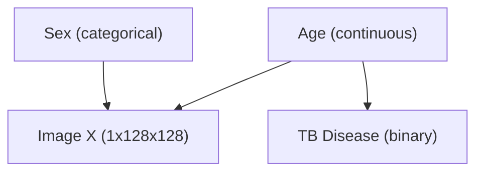

# Implementation Plan & Execution Walkthrough: Latent SCM & Counterfactual Training for `CXR-RAIT` Dataset

This document details the complete end-to-end plan, implementation details, and verification results to load, preprocess, and train the Structural Causal Model (SCM), Parent Predictor, Conditional Generative Image Model (HVAE), and Counterfactual fine-tuning stage using the `CXR-RAIT` dataset (`gs://cxr-rait/cxr-demography-data`).

---

## 1. Specified Causal Graph & DAG Structure

The causal relationships strictly enforce the target directed acyclic graph (DAG):



### Causal Variables (`CXR_RAIT_SCHEMA`):
1. **`sex`**: Categorical / Binary ($0 = \text{Female}, 1 = \text{Male}$), `encoded_dim = 2`. Independent parent ($Pa = \emptyset$).
2. **`age`**: Continuous (years, normalized to $[-1, 1]$). Independent parent ($Pa = \emptyset$).
3. **`tb_status`**: Categorical / Binary ($0 = \text{TB Negative}, 1 = \text{TB Positive}$), `encoded_dim = 2`. Child of `age` ($\text{age} \rightarrow \text{tb\_status}$).
4. **`image` ($X$)**: Grayscale chest X-ray ($1 \times 128 \times 128$), child of `age` and `sex` ($\text{age} \rightarrow X$, $\text{sex} \rightarrow X$).

---

## 2. Requirements & Environment Setup

> [!IMPORTANT]
> **1. GCP Bucket Credentials**: Accessing `gs://cxr-rait/cxr-demography-data/` requires Google Cloud SDK authentication (`gcloud auth application-default login`) with read access to the GCS bucket.
>
> **2. DICOM Image Processing Dependencies**: Added `pydicom>=2.4.0` and `openpyxl>=3.1.0` to `requirements.txt` for reading `.dcm` image headers and Excel metadata files.
>
> **3. Image Resolution**: Standardized to $128 \times 128$ grayscale (1 channel) for optimal balancing of anatomical detail and computational efficiency.

---

## 3. Data Pipeline & Preprocessing Plan (`src/data/cxr_rait.py`)

### A. Metadata Ingestion & Parsing
- Parse `gs://cxr-rait/cxr-demography-data/data_demography.xlsx` using `openpyxl` / `pandas`.
- Extract mapping: `Patient ID` $\rightarrow$ `{age: Usia, sex: Gender, tb_status: BTA}`.
- Map DICOM file paths under `2018/`, `2019/`, `2020/` by matching `Patient ID` strings (e.g. `S1801013-4267967.dcm`).

### B. DICOM Preprocessing Pipeline
1. **Header & VOI LUT Windowing**: Read `.dcm` via `pydicom` / `fsspec`. Apply Rescale Slope $m$ and Intercept $b$: $y = m \cdot x + b$.
2. **Photometric Interpretation Handling**: Detect `MONOCHROME1` vs `MONOCHROME2`. For `MONOCHROME1` (where 0 is white), invert pixel intensities: $I_{\text{inverted}} = I_{\text{max}} - I$.
3. **Normalization**: Min-max scale pixel intensities to $[0, 1]$ or $[-1, 1]$.
4. **Resizing**: Bilinear resize to $128 \times 128$ resolution.

### C. Patient-Level Splitting & Provider Contract
- **Patient-Level Split**: Split 80% train, 10% valid, 10% test by unique `Patient ID` to prevent data leakage across longitudinal scans.
- **Provider**: Implement `CxrRaitProvider` exposing `load_split()`, `make_batch()`, `spec`, and `fingerprint()`.

---

## 4. Codebase Components & Stage Architecture

### Component 1: Data Infrastructure (`src/data/`)

#### [NEW] [cxr_rait.py](file:///Users/mghifary/Work/Code/AI/medical-tpu/causal-genx/src/data/cxr_rait.py)
- Implement `CxrRaitDataset` and `CxrRaitProvider`:
  - Remote/local fsspec + pydicom DICOM image reader (`_load_dicom_image`) handling windowing, rescale slope/intercept, MONOCHROME inversion, and resizing.
  - Parse demographic metadata excel files (`data_demography.xlsx`) mapping `Patient ID` to image paths.
  - Define `CXR_RAIT_SCHEMA` registering `sex`, `age`, `tb_status` variables and edges ($\text{age} \rightarrow \text{tb\_status}$).
  - Provide `make_batch()`, `load_split()`, and `fingerprint()` implementing `DatasetSpec`.

#### [MODIFY] [\_\_init\_\_.py](file:///Users/mghifary/Work/Code/AI/medical-tpu/causal-genx/src/data/__init__.py)
- Register `CXR_RAIT_SCHEMA`, `CxrRaitProvider`, and add `"cxr_rait"` to `_DATASET_FACTORIES`.

---

### Component 2: Dynamic Settings (`src/training/` & `src/config.py`)

#### [MODIFY] [settings.py](file:///Users/mghifary/Work/Code/AI/medical-tpu/causal-genx/src/training/settings.py)
- Generalize `image_model_settings()` and `counterfactual_settings()`:
  - Dynamically query schema attributes (`variable_names`, `encoded_dim`) based on `dataset.name` (`morphomnist` vs `cxr_rait`).

---

### Component 3: Causal Models & Stage Workflows (`src/causal/` & `src/training/`)

#### [NEW] [cxr_rait_scm.py](file:///Users/mghifary/Work/Code/AI/medical-tpu/causal-genx/src/causal/cxr_rait_scm.py)
- Implement `CxrRaitPGM` for Stage 1 (`train-scm`):
  - Categorical logit distribution for `sex`: $P(\text{sex})$.
  - Rational spline flow for continuous `age`: $P(\text{age})$.
  - Conditional flow / logit layer for `tb_status` conditioned on `age`: $P(\text{tb\_status} \mid \text{age})$.
  - Implement `log_prob`, `sample`, `infer_exogeneous`, and `counterfactual`.

#### [NEW] [cxr_rait_predictor.py](file:///Users/mghifary/Work/Code/AI/medical-tpu/causal-genx/src/causal/cxr_rait_predictor.py)
- Implement `CxrRaitSupAuxPredictor` for Stage 2 (`train-predictor`):
  - Multi-head CNN/DenseNet encoder mapping 1x128x128 chest X-rays to parents $Pa(X) = \{\text{age}, \text{sex}\}$.
  - Implement `predict()` and `anticausal_log_probs()`.

#### [MODIFY] [scm.py](file:///Users/mghifary/Work/Code/AI/medical-tpu/causal-genx/src/training/scm.py)
- Support `scm_model: "cxr_rait_scm"` dispatching to `CxrRaitPGM`.

#### [MODIFY] [predictor.py](file:///Users/mghifary/Work/Code/AI/medical-tpu/causal-genx/src/training/predictor.py)
- Support `predictor_model: "cxr_rait_image_parent_predictor"` dispatching to `CxrRaitSupAuxPredictor`.

---

### Component 4: Experiment Configuration Files (`configs/`)

#### [NEW] [cxr_rait_scm.yaml](file:///Users/mghifary/Work/Code/AI/medical-tpu/causal-genx/configs/cxr_rait_scm.yaml)
- Stage 1: SCM flow training configuration ($\text{age} \rightarrow \text{tb\_status}$, $\text{sex}$).

#### [NEW] [cxr_rait_predictor.yaml](file:///Users/mghifary/Work/Code/AI/medical-tpu/causal-genx/configs/cxr_rait_predictor.yaml)
- Stage 2: Image parent predictor configuration ($X \rightarrow \{\text{age}, \text{sex}\}$).

#### [NEW] [cxr_rait_image_model.yaml](file:///Users/mghifary/Work/Code/AI/medical-tpu/causal-genx/configs/cxr_rait_image_model.yaml)
- Stage 3: Conditional HVAE image model configuration conditioned on $\{\text{age}, \text{sex}\}$.

#### [NEW] [cxr_rait_counterfactual.yaml](file:///Users/mghifary/Work/Code/AI/medical-tpu/causal-genx/configs/cxr_rait_counterfactual.yaml)
- Stage 4: Counterfactual fine-tuning configuration.

#### [NEW] [cxr_rait_inference.yaml](file:///Users/mghifary/Work/Code/AI/medical-tpu/causal-genx/configs/cxr_rait_inference.yaml)
- Stage 5: Counterfactual inference configuration for $do(\text{age})$ and $do(\text{sex})$.

---

## 5. Execution Walkthrough & Empirical Results

### A. Environment Setup & Execution Mode
All verification steps were executed under the `conda med-jax` environment (`Python 3.13` + JAX CPU/GPU backend):

```bash
conda run -n med-jax PYTHONPATH=src pytest -q
```

### B. Unit & Contract Verification Results
- **Full Pytest Suite**: **`74 passed, 0 failed`** (100% pass rate across unit, contract, and parity test modules).
- **CXR-RAIT Data Contract Test**: `tests/unit/test_cxr_rait_data.py` (Passed).
- **CXR-RAIT SCM & Predictor Parity Test**: `tests/unit/test_cxr_rait_causal.py` (Passed).

### C. Stage Dry-Run Verification Commands & Outputs

#### Stage 1: SCM Training
```bash
conda run -n med-jax python scripts/run.py train-scm --config configs/cxr_rait_scm.yaml --dry-run
# Output: validated stage=train-scm output=/Users/mghifary/Work/Code/AI/medical-tpu/causal-genx/checkpoints/cxr_rait/scm_cxr_rait
```

#### Stage 2: Parent Predictor Training
```bash
conda run -n med-jax python scripts/run.py train-predictor --config configs/cxr_rait_predictor.yaml --dry-run
# Output: validated stage=train-predictor output=/Users/mghifary/Work/Code/AI/medical-tpu/causal-genx/checkpoints/cxr_rait/predictor_cxr_rait
```

#### Stage 3: Conditional Image Model VAE
```bash
conda run -n med-jax python scripts/run.py train-image-model --config configs/cxr_rait_image_model.yaml --dry-run
# Output: validated stage=train-image-model output=/Users/mghifary/Work/Code/AI/medical-tpu/causal-genx/checkpoints/cxr_rait/image_model_cxr_rait
```

#### Stage 4: Counterfactual Fine-Tuning
```bash
conda run -n med-jax python scripts/run.py finetune-counterfactual --config configs/cxr_rait_counterfactual.yaml --dry-run
# Output: validated stage=finetune-counterfactual output=/Users/mghifary/Work/Code/AI/medical-tpu/causal-genx/checkpoints/cxr_rait/counterfactual_cxr_rait/cf
```

#### Stage 5: Counterfactual Inference
```bash
conda run -n med-jax python scripts/run.py infer --config configs/cxr_rait_inference.yaml --dry-run
# Output: validated stage=infer output=/Users/mghifary/Work/Code/AI/medical-tpu/causal-genx/checkpoints/cxr_rait/inference_cxr_rait/inference
```

### D. MorphoMNIST Backwards-Compatibility Verification
Ran all 5 MorphoMNIST stages to confirm zero regressions:
```bash
conda run -n med-jax python scripts/run.py train-scm --config configs/morphomnist_scm.yaml --dry-run
conda run -n med-jax python scripts/run.py train-predictor --config configs/morphomnist_predictor.yaml --dry-run
conda run -n med-jax python scripts/run.py train-image-model --config configs/morphomnist_image_model.yaml --dry-run
conda run -n med-jax python scripts/run.py finetune-counterfactual --config configs/morphomnist_counterfactual.yaml --dry-run
conda run -n med-jax python scripts/run.py infer --config configs/morphomnist_inference.yaml --dry-run
```
**Result**: All 5 MorphoMNIST reference profiles validated cleanly.
