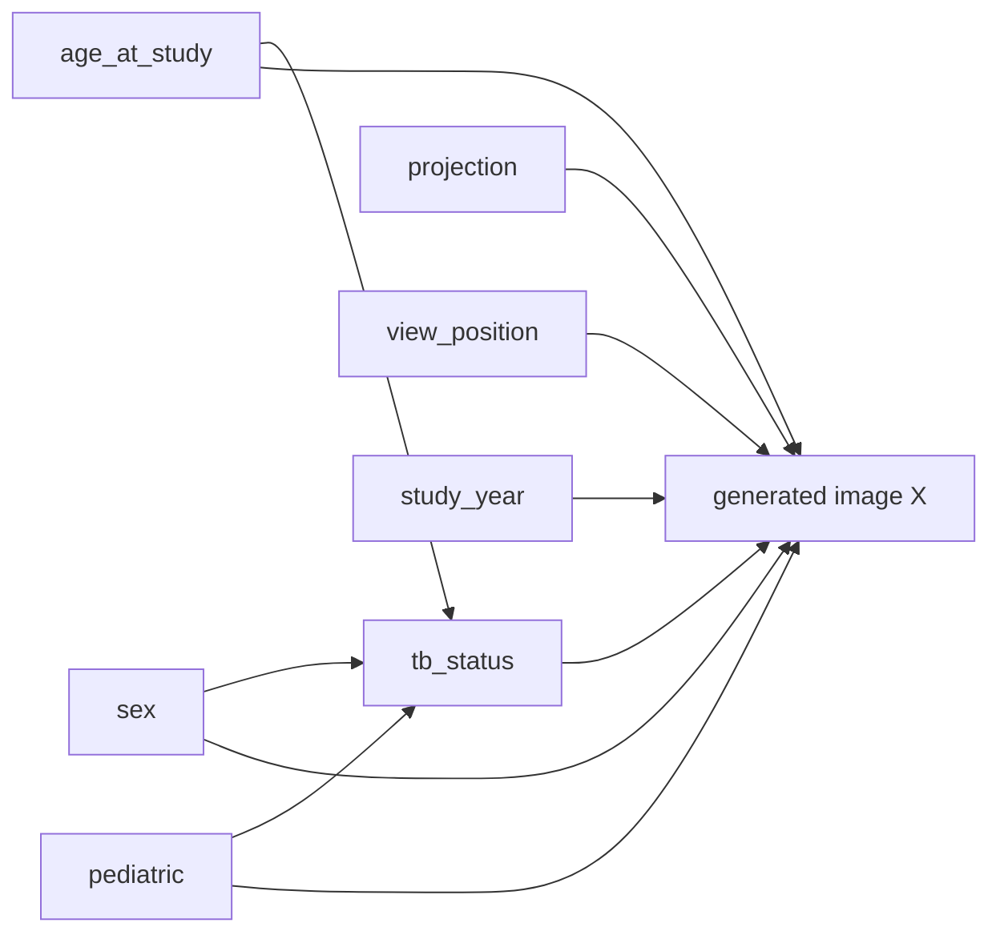

# PadChest context-17 HVAE image-generation results

## Summary

This report records a controlled generation run from the PadChest hierarchical
VAE (HVAE) image generator checkpoint:

```text
gs://external-cxr-dataset/padchest/checkpoints_context17/padchest/
  image_model_padchest_tpu_v6e1_context17/checkpoints/260650
```

The checkpoint was trained for 128 x 128 grayscale chest radiographs and uses
the 17-dimensional PadChest causal context:

```text
age_at_study, sex[2], pediatric, tb_status,
projection[5], view_position[6], study_year
```

The model is a hierarchical HVAE with `z_dim=16`, conditional prior enabled,
the `128b3d2,64b3d4,16b3d4,4b3d4,1b4` encoder, and
`1b4,4b4,16b4,64b4,128b4` decoder. The checkpoint metadata reports TPU v6e-1
training, bf16 training precision, batch size 32, EMA rate 0.999, and
checkpoint step 260650.

## Reproducible command

The inference implementation was extended to encode PadChest categorical
parents, generate multiple stochastic samples, and write them to an explicit
directory. The base configuration is
[padchest_inference_context17.yaml](../configs/padchest_inference_context17.yaml).

The generation command used a local copy of the checkpoint downloaded from the
GCS path above:

```bash
JAX_PLATFORMS=cpu PYTHONPATH=src python scripts/run.py infer \
  --config configs/padchest_inference_context17.yaml \
  workflow.checkpoint=/private/tmp/padchest-context17/checkpoints
```

Each scenario generated four images with the same random seed (`17`). The
latent temperature was passed to the decoder and likelihood sampler. A value
of `1.0` is the standard prior scale; `0.7` is a lower-variance sample.

## Quantitative diagnostics

The inference stage reports ELBO components from a zero-image diagnostic pass.
Because no observed image was supplied (`image_path` is empty), these numbers
are runtime/model diagnostics rather than held-out reconstruction scores.

| Scenario | ELBO | NLL | KL | Latent temperature |
|---|---:|---:|---:|---:|
| TB negative, female, PA | 0.5576 | 0.3198 | 0.2378 | 1.0 |
| TB positive, female, PA | 0.5665 | 0.3332 | 0.2333 | 1.0 |
| Pediatric, male, AP, TB positive | 0.8550 | 0.5802 | 0.2748 | 1.0 |
| TB positive, male, PA, lower latent temperature | 0.5687 | 0.3367 | 0.2320 | 0.7 |

The generated PNG pixel statistics were computed after converting the 8-bit
outputs to `[0,1]` grayscale values. They are useful for detecting output
collapse or gross distribution shifts, but they are not medical image quality
metrics.

| Scenario | Mean pixel value | Mean per-image pixel std | Min/max across images |
|---|---:|---:|---:|
| TB negative, female, PA | 0.4548 | 0.2608 | 0.0000 / 1.0000 |
| TB positive, female, PA | 0.4505 | 0.2659 | 0.0000 / 1.0000 |
| Pediatric, male, AP, TB positive | 0.4278 | 0.2636 | 0.0000 / 1.0000 |
| TB positive, male, PA, temperature 0.7 | 0.4796 | 0.2503 | 0.0000 / 1.0000 |

The close means and nonzero spatial standard deviations indicate that all four
settings produced nonconstant radiograph-like outputs. The pediatric/AP
setting has the highest ELBO and NLL in this small diagnostic comparison; this
single sample panel is not sufficient to attribute that difference to either
the pediatric or projection intervention.

## Causal-variable configurations

Continuous values use the training `[-1, 1]` normalization. Categorical values
are integer indices in the order used by the PadChest provider:

| Variable | Configuration used |
|---|---|
| `age_at_study` | `0.0` (normalized midpoint) |
| `sex` | `0 = female`, `1 = male` |
| `pediatric` | `0 = no`, `1 = yes` |
| `tb_status` | `0 = negative`, `1 = positive/sequelae` |
| `projection` | `0 = PA`, `1 = AP`, `2 = AP_horizontal`, `3 = L`, `4 = COSTAL` |
| `view_position` | `0 = POSTEROANTERIOR`, `1 = ANTEROPOSTERIOR`, followed by the provider’s remaining categories |
| `study_year` | `0.2` (normalized value) |

The generated scenarios were:

1. TB negative, female, PA, non-pediatric.
2. TB positive, female, PA, non-pediatric.
3. TB positive, male, pediatric, AP.
4. TB positive, male, PA, non-pediatric, latent temperature `0.7`.

## Causal graph used in the evaluation

The evaluation uses the PadChest schema declared in the training and inference
configs. The tabular causal graph contains three direct causes of `tb_status`:
`age_at_study`, `sex`, and `pediatric`. The HVAE image mechanism is conditioned
on the complete 17-dimensional context, so every listed context variable also
feeds the generated image node `X`.



The graph edges used by the SCM are:

```text
age_at_study  ──▶ tb_status
sex           ──▶ tb_status
pediatric     ──▶ tb_status
```

The remaining acquisition variables (`projection`, `view_position`) and the
time variable (`study_year`) have no tabular outgoing edges in this schema, but
they remain direct image-conditioning variables. The image generator therefore
models `X` from the full context vector in this order:

```text
[age_at_study,
 sex[2],
 pediatric,
 tb_status,
 projection[5],
 view_position[6],
 study_year]
```

This gives `1 + 2 + 1 + 1 + 5 + 6 + 1 = 17` context dimensions, matching the
context-17 checkpoint used for the samples in this report. The causal
interventions in the evaluation modify these context values before decoding;
the latent temperature changes stochastic HVAE sampling while leaving the
causal parent vector fixed.

## Qualitative visualization

The complete 4 x 4 panel is available here:


### TB negative, female, PA


### TB positive, female, PA


### Pediatric, male, AP, TB positive


### Lower-temperature latent sampling


Qualitatively, the outputs preserve a chest-radiograph composition with a
central mediastinum, bilateral lung fields, and a bright lower thoracic/upper
abdomen region. The latent draws change local texture and intensity while
preserving the broad anatomy. The pediatric/AP panel appears more compact and
higher contrast than the PA panels, but this observation is descriptive only;
the generator has not been clinically validated for intervention fidelity.

## Artifacts

Generated images and per-run metadata are under
`causal-genx/samples/padchest/`:

- `scenario_tb_negative/`
- `scenario_tb_positive_female/`
- `scenario_pediatric_ap/`
- `scenario_latent_cool/`
- `context17_panel.png`
- `inference.json` for each scenario

The inference code change also fixes JAX PRNG-key handling in the Gaussian
likelihood sampler, where using a JAX key in a Python boolean expression caused
multi-sample generation to fail.

## Limitations and next evaluation steps

- The quantitative values above come from one checkpoint and four samples per
  setting; they are not a benchmark or clinical validation.
- The ELBO/NLL/KL pass uses a zero image because this experiment tests prior
  generation. Reconstruction metrics require observed PadChest images.
- A stronger evaluation should generate many seeds per intervention and report
  image diversity, parent-predictor agreement, calibration of TB status, and
  distributional distances against a held-out PadChest split.
- Visual inspection should be performed by a radiologist before interpreting
  any apparent disease or acquisition effects.
