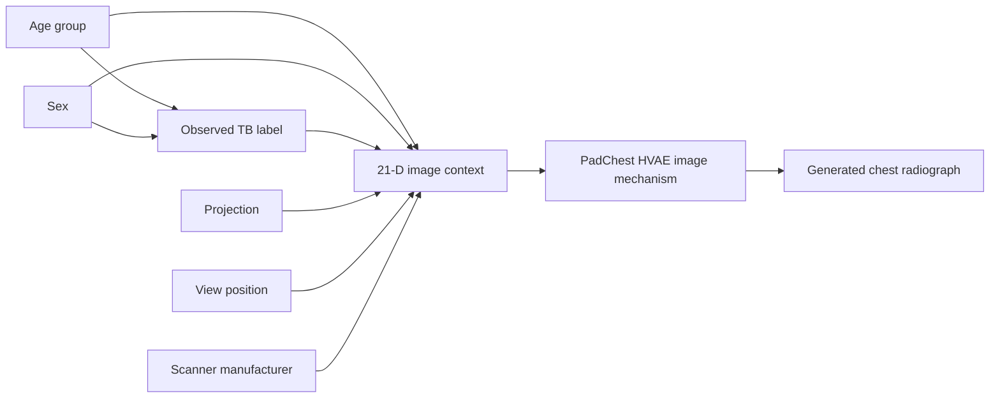
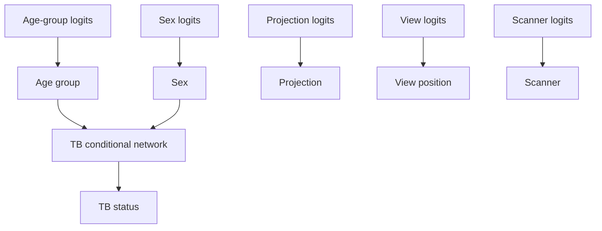

# Revised PadChest SCM training scenario

**Date:** 2026-09-28  
**Status:** Proposed retraining specification  
**Dataset:** PadChest metadata  
**Purpose:** Define the revised SCM and image-conditioning context after
removing `pediatric`, `study_year`, and `Modality_DICOM`, while adding scanner
manufacturer and discretized age groups.

## Executive summary

The original PadChest SCM used seven metadata variables and a 17-dimensional
parent vector:

```text
age_at_study, sex, pediatric, tb_status,
projection, view_position, study_year
```

The revised scenario uses a smaller and more explicit representation:

```text
age_group, sex, tb_status, projection, view_position, scanner
```

The revised encoded context has **21 dimensions**:

```text
age_group[5]
+ sex[2]
+ tb_status[1]
+ projection[5]
+ view_position[6]
+ scanner[2]
= 21 dimensions
```

This is a new model contract. The existing 17-dimensional SCM and the
context-17 HVAE checkpoint cannot be reused without retraining or an explicit
adapter, because the parent order and meaning have changed.

## Motivation for the redesign

### Remove `pediatric` as an independent parent

The PadChest CSV uses the values `No` and `PED` in its `Pediatric` field. The
current provider checks for the string `yes`, which maps every row to
`pediatric=0`. The completed SCM therefore did not learn a pediatric mechanism.

The source field is also sparse: only 274 of 160,855 rows with valid derived
age are marked `PED`. A derived age group is more consistently available and
has direct support for pediatric stratification.

`Pediatric` will remain available for data-quality auditing, but it will not be
a trainable SCM parent in this scenario.

### Discretize age

The continuous spline representation is replaced with five interpretable
groups:

```text
0–4, 5–17, 18–39, 40–64, 65+
```

This makes interventions explicit, avoids extrapolating a smooth age curve
where the metadata support is sparse, and makes the TB mechanism easier to
inspect. It also allows the pediatric group to be represented without a second,
potentially inconsistent field.

### Remove `study_year`

`study_year` can represent temporal and acquisition drift, but it is not needed
for the disease-focused SCM proposed here. Removing it avoids treating age and
study year as independent roots even though age is derived from study year and
birth year. Temporal and scanner-shift analyses should be evaluated separately
as sensitivity experiments.

### Keep scanner manufacturer for image conditioning

PadChest contains two manufacturer categories:

| Scanner manufacturer | Images | Proportion |
|---|---:|---:|
| `ImagingDynamicsCompanyLtd` | 79,777 | 49.6% |
| `PhilipsMedicalSystems` | 81,084 | 50.4% |

Scanner manufacturer can affect contrast, noise, dynamic range, and other
appearance characteristics. It is therefore useful for the image mechanism,
but it should not be treated as a direct cause of TB status.

`Modality_DICOM` is excluded because it is strongly associated with
manufacturer and introduces an additional acquisition label without being
needed for this first revised experiment.

## Revised causal graph

The tabular SCM declares age group and sex as parents of the observed TB label.
Projection, view position, and scanner manufacturer condition the image
mechanism but are not declared direct causes of TB.



The revised SCM factorization is:

```text
p(age_group)
  p(sex)
  p(projection)
  p(view_position)
  p(scanner)
  p(tb_status | age_group, sex)
```

The image model consumes the concatenated context:

```text
p(image | age_group, sex, tb_status,
             projection, view_position, scanner)
```

The graph is a modeling assumption for controlled generation. It is not a
claim that age group or sex alone causes clinical TB, and it does not account
for all confounding, referral, exposure, comorbidity, or label-generation
processes.

## Parent-vector contract

The exact vector order is:

| Indices | Variable | Dimensions | Encoding |
|---:|---|---:|---|
| 0–4 | `age_group` | 5 | One-hot: `0-4`, `5-17`, `18-39`, `40-64`, `65+` |
| 5–6 | `sex` | 2 | One-hot: non-M/unknown, M |
| 7 | `tb_status` | 1 | Binary: 0 or 1 |
| 8–12 | `projection` | 5 | One-hot: PA, AP, AP_horizontal, L, COSTAL |
| 13–18 | `view_position` | 6 | One-hot: POSTEROANTERIOR, ANTEROPOSTERIOR, LATERAL, AP, PA, OTHER |
| 19–20 | `scanner` | 2 | One-hot: ImagingDynamicsCompanyLtd, PhilipsMedicalSystems |

The total is:

```text
5 + 2 + 1 + 5 + 6 + 2 = 21
```

Example context for a 5–17-year-old male, TB-positive, PA,
POSTEROANTERIOR, Philips study:

```python
[
    0, 1, 0, 0, 0,       # age_group = 5-17
    0, 1,                # sex = M
    1,                   # tb_status = positive
    1, 0, 0, 0, 0,       # projection = PA
    1, 0, 0, 0, 0, 0,    # view_position = POSTEROANTERIOR
    0, 1,                # scanner = PhilipsMedicalSystems
]
```

## Data derivation

Age is derived from DICOM study year and birth year, then assigned to one
group. The implementation should use half-open intervals to avoid boundary
ambiguity:

```python
def derive_age_group(study_date: str, patient_birth: float) -> str:
    study_year = int(str(study_date)[:4])
    age = float(np.clip(study_year - patient_birth, 0.0, 110.0))

    if age <= 4:
        return "0-4"
    if age <= 17:
        return "5-17"
    if age <= 39:
        return "18-39"
    if age <= 64:
        return "40-64"
    return "65+"
```

The source field `Pediatric` should be retained for audit-only comparisons:

```python
source_pediatric = str(row.get("Pediatric", "")).strip().upper() == "PED"
derived_pediatric = age < 18
```

The audit must report disagreements rather than silently replacing one field
with the other. In the downloaded CSV, 270 of 274 `PED` rows have derived age
under 18, while 6,916 additional rows have derived age under 18 but are marked
`No`. This is another reason not to use the raw field as an independent causal
parent without a metadata-quality investigation.

TB status remains derived using the configured `tb_or_sequelae` mode:

```python
tb_status = int(
    {"tuberculosis", "tuberculosis sequelae"}.intersection(labels)
)
```

The scanner field is read from `Manufacturer_DICOM` and mapped to the two
observed categories. Unknown values must fail validation or be assigned to an
explicit `OTHER` category after support analysis; they must not be silently
mapped to one manufacturer.

## Expected data support

The full metadata cohort has the following derived age-group support and TB
rates:

| Age group | Rows | Mean age | TB-positive rate |
|---|---:|---:|---:|
| 0–4 | 3,078 | 1.96 | 0.227% |
| 5–17 | 4,108 | 10.89 | 0.414% |
| 18–39 | 19,353 | 30.89 | 0.930% |
| 40–64 | 61,194 | 53.07 | 0.745% |
| 65+ | 73,122 | 75.54 | 0.893% |

All five groups have support, but the pediatric groups are much smaller than
the adult groups. Training and evaluation must report confidence intervals or
bootstrap variability for pediatric and TB-positive subgroup estimates.

The scanner–modality relationship in the source metadata is:

| Scanner | CR | DX |
|---|---:|---:|
| ImagingDynamicsCompanyLtd | 79,777 | 0 |
| PhilipsMedicalSystems | 69,085 | 11,999 |

Although modality is excluded, this table shows why scanner can act as an
acquisition proxy. Scanner should be evaluated for shortcut behavior and image
style changes.

## SCM mechanism

The revised SCM uses categorical logits for age group, sex, projection, view
position, and scanner. TB is a Bernoulli conditional head:

```text
TB logits = f(age_group_one_hot, sex_one_hot)
TB status  ~ Bernoulli(sigmoid(TB logits))
```

The sampling flow is:



The model should preserve the existing metadata-only optimization path so SCM
training does not download PNG images. Image reads belong to the later
predictor and HVAE stages.

## Proposed training configuration

Start with the existing PadChest SCM settings unless the first smoke run shows
a clear optimization problem:

```yaml
dataset:
  name: padchest
  input_res: 128
  tb_label_mode: tb_or_sequelae

causal_schema:
  version: "2"
  variables: [age_group, sex, tb_status, projection, view_position, scanner]
  edges: [[age_group, tb_status], [sex, tb_status]]

model:
  name: padchest_scm
  context_dim: 21

optimizer:
  lr: 0.0001
  weight_decay: 0.1
  batch_size: 64

workflow:
  type: train-scm
  epochs: 100
  widths: [64, 64]
  checkpoint_freq: 1
  plot_samples: 1000
```

The revised run must use a new run name and checkpoint prefix. It must not
overwrite `scm_padchest_tpu_v6e1`, because that directory contains the old
17-dimensional artifact.

## Training stages

### Stage 1: schema and derivation audit

Before training:

1. Verify all six variables and the 21-dimensional order.
2. Print counts for every age group, sex category, projection, view position,
   scanner category, and TB status.
3. Report unknown scanner values and missing source fields.
4. Report disagreement between raw `Pediatric == PED` and derived age `<18`.
5. Freeze the patient-level split and metadata SHA-256.

### Stage 2: smoke training

Run a short metadata-only smoke job to verify:

- categorical logits have the expected shapes;
- TB conditional inputs have dimension 7 (`age_group[5] + sex[2]`);
- losses are finite;
- checkpoint save and restore work;
- generated samples contain valid one-hot vectors;
- no image or GCS object reads occur in the SCM batch path.

### Stage 3: full training

Run 100 epochs with validation every epoch. Retain the final EMA checkpoint and
the best validation checkpoint as separate immutable steps. Record throughput,
gradient norms, train loss, validation loss, and per-variable log probabilities.

### Stage 4: multi-seed stability

Repeat the full run with at least two additional seeds. Compare:

- validation loss;
- age-group probabilities;
- TB rates by age group and sex;
- scanner and acquisition marginals;
- checkpoint-generated sample variability.

## Acceptance criteria

The revised SCM should be accepted for downstream image conditioning only if:

- the restored checkpoint reports `context_dim=21`;
- the schema version and parent order are stored in checkpoint metadata;
- all five age groups have train and validation support;
- scanner categories are represented without unknown-category collapse;
- test loss and all per-variable likelihoods are finite;
- generated categorical fields are valid one-hot or binary values;
- the TB head produces probabilities in `[0,1]`;
- test marginal TVD is reported for every categorical variable;
- TB calibration is reported overall and by age group and sex;
- pediatric-specific results are reported with uncertainty because support is
  limited;
- the old 17-dimensional checkpoint is never loaded into the new model.

## Diagnostics and qualitative checks

Required quantitative diagnostics:

- negative joint log likelihood on train, validation, and test;
- age-group marginal frequencies and TB rates;
- sex marginal and TB rates by sex;
- projection, view-position, and scanner marginal TVD;
- scanner-conditioned image-generation samples;
- TB calibration, Brier score, and expected calibration error;
- multi-seed mean and standard deviation of key metrics.

Required visual diagnostics:

1. Observed versus sampled age-group frequencies.
2. TB probability by age group and sex.
3. Scanner-conditioned image samples with all other parents fixed.
4. Projection/view-position samples under each scanner category.

Scanner-conditioned HVAE samples should be interpreted as acquisition-style
comparisons. They must not be interpreted as evidence that scanner identity
causes disease.

## Risks and mitigations

| Risk | Mitigation |
|---|---|
| Age bins hide within-group effects | Keep a continuous-age sensitivity model |
| Pediatric groups are sparse | Report uncertainty and avoid strong subgroup claims |
| Scanner becomes a shortcut | Compare models with and without scanner conditioning |
| Scanner proxies for institution or time | Use patient-level splits and subgroup diagnostics |
| Invalid scanner categories are generated | Use explicit category validation and one-hot checks |
| Old checkpoints are accidentally reused | Increment schema version and use a new artifact path |
| TB labels include sequelae and report artifacts | Report results as observed TB-related labels, not confirmed disease |

## Final interpretation

This revised scenario is a better fit for the current dataset than the original
schema because it removes the broken pediatric parser dependency, avoids the
redundancy between pediatric status and age, removes the age–study-year
independence problem, and preserves scanner variation for image generation.

It remains a controlled generative metadata model rather than a fully identified
clinical causal model. The new 21-dimensional SCM should therefore be used to
test parent-conditioned image generation and acquisition-style robustness, with
clinical and causal claims limited to what the observational metadata can
support.
