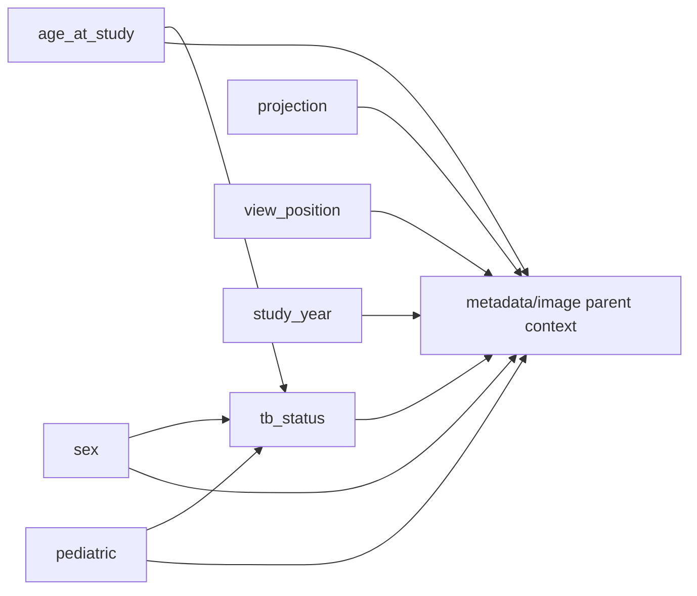
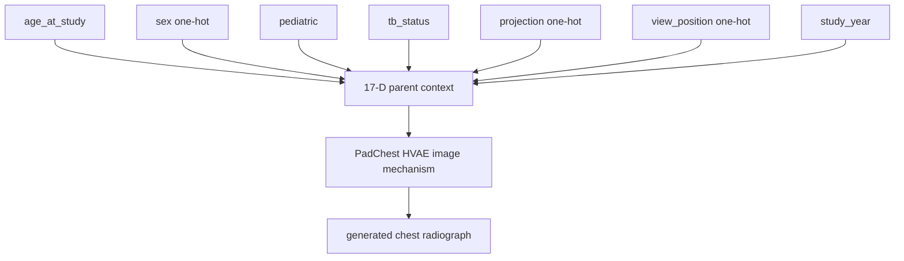
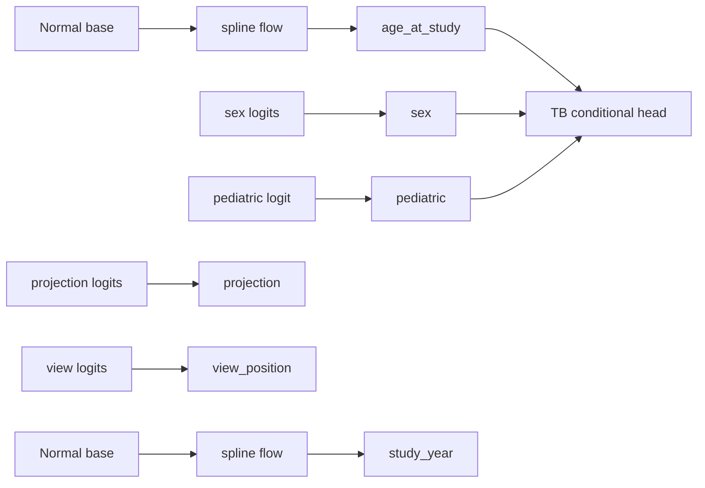

# PadChest SCM training outcome

**Date:** 2026-09-28  
**Run:** `scm_padchest_tpu_v6e1`  
**Checkpoint evaluated:** step `200500`  
**Dataset:** PadChest metadata, `tb_or_sequelae` label mode

## Executive summary

The PadChest structural causal model (SCM) completed its configured 100-epoch
optimization run on one TPU v6e-1 device. The final checkpoint was restored
successfully and evaluated on the patient-level test split.

| Quantity | Result |
|---|---:|
| Train epochs | 100 / 100 |
| Final step | 200,500 |
| Final train loss | 7.0141 |
| Final validation loss | 6.7938 |
| Test loss from restored EMA checkpoint | 6.5571 |
| Train / validation / test rows | 128,343 / 16,297 / 16,221 |
| Encoded parent dimension | 17 |
| Final checkpoint compatibility | `params`, `model_params`, and `ema_params` restored successfully |

The SCM learned a metadata distribution that is close to the held-out test
split for sex, TB status, projection, view position, age, and study year. The
most important support limitation is pediatric data: the test split contains no
pediatric-positive rows, so pediatric calibration cannot be assessed from this
split. The training process also exited nonzero while attempting to publish a
metric artifact to GCS; the local optimization and final checkpoint were
already complete, but remote artifact publication was not cleanly verified.

## Purpose of this SCM

This stage models the structured parent variables used by later Causal-GenX
stages. It supplies:

1. a joint distribution for sampling plausible PadChest metadata;
2. a structural mechanism for generating TB status conditional on demographic
   variables; and
3. the parent representation used to condition the image predictor and HVAE.

The SCM does **not** model image pixels. The image mechanism is trained later.
Therefore, its outcome should be interpreted as metadata-distribution and
intervention support evidence, not as a clinical TB detector or proof that the
declared edges are causal in the real world.

## Data and variable construction

The authoritative configuration is
[`configs/padchest_scm_tpu_v6e1.yaml`](../configs/padchest_scm_tpu_v6e1.yaml).
Metadata rows are grouped by `PatientID` before splitting, so images from one
patient are kept in one split. Seed 7 produces the following row counts:

| Split | Patients | Rows with `ImageID` |
|---|---:|---:|
| Train | 54,100 | 128,343 |
| Validation | 6,762 | 16,297 |
| Test | 6,763 | 16,221 |

The variable encoding is:

| Variable | Encoding and derivation |
|---|---|
| `age_at_study` | Study year minus birth year, clipped to 0–110 and normalized to `[-1, 1]` |
| `sex` | Two-way one-hot; `PatientSex_DICOM == M` is category 1, other/unknown is category 0 |
| `pediatric` | Binary indicator from `Pediatric == yes` |
| `tb_status` | Binary; positive when labels contain `tuberculosis` or `tuberculosis sequelae` |
| `projection` | Five-way one-hot: `PA`, `AP`, `AP_horizontal`, `L`, `COSTAL` |
| `view_position` | Six-way one-hot: `POSTEROANTERIOR`, `ANTEROPOSTERIOR`, `LATERAL`, `AP`, `PA`, `OTHER` |
| `study_year` | DICOM year normalized from 2007–2017 to `[-1, 1]` |

The encoded parent order is fixed as:

```text
age_at_study, sex, pediatric, tb_status,
projection, view_position, study_year
```

The dimensions are `1 + 2 + 1 + 1 + 5 + 6 + 1 = 17`.

## Causal graph and reasoning

The declared graph is:



The three SCM edges are:

```text
age_at_study  ──▶ tb_status
sex           ──▶ tb_status
pediatric     ──▶ tb_status
```

### Why age influences TB status

Age is a plausible parent of observed TB status because disease prevalence,
prior exposure, immune response, and the clinical population receiving chest
radiography vary over the life course. In this implementation, age enters the
TB mechanism as a continuous normalized value. The graph does not say that age
alone determines TB; it says that the conditional TB probability may vary with
age after accounting for the other declared parents.

### Why sex influences TB status

Sex is included because the observed TB label distribution can differ across
sex categories through epidemiology, exposure patterns, comorbidity, and
healthcare-seeking or referral processes. It is represented as a two-dimensional
one-hot parent. The model uses it as a predictor of TB status, not as a claim
that biological sex is a sufficient explanation for the observed association.

### Why pediatric status influences TB status

Pediatric status separates children from the adult population and can change
both disease prevalence and the pathway by which a patient is imaged and
labeled. It is therefore a useful parent for the TB mechanism. The local test
split has zero pediatric-positive examples, so the data cannot identify or
validate this relationship robustly in the held-out diagnostics.

### Why projection, view position, and study year are not TB parents here

Projection and view position describe image acquisition. Study year describes
when the examination occurred. They may be associated with referral practice,
scanner availability, or labeling policy, but this SCM deliberately leaves them
as exogenous marginal variables rather than asserting direct arrows into
`tb_status`. They are still retained as image-conditioning variables because
they affect the appearance and acquisition style of the generated radiograph.

This is a modeling choice that keeps the graph small and interpretable. It does
not prove that acquisition and time have no relationship to TB in the source
population. If those paths are needed for a particular scientific question,
they should be introduced explicitly and evaluated with an appropriate
identification argument rather than inferred from this checkpoint.

### Factorization represented by the model

The declared graph corresponds to the factorization:

```text
p(age_at_study, sex, pediatric, tb_status,
  projection, view_position, study_year)

= p(age_at_study)
  p(sex)
  p(pediatric)
  p(projection)
  p(view_position)
  p(study_year)
  p(tb_status | age_at_study, sex, pediatric)
```

The image generator later conditions on the concatenated 17-dimensional vector:



## SCM mechanism and training setup

The implementation in `src/causal/cxr_rait_scm.py` uses:

- spline-flow marginals for continuous `age_at_study` and `study_year`;
- categorical marginals for `sex`, `projection`, and `view_position`;
- Bernoulli marginals for `pediatric`;
- a Bernoulli TB head conditioned on age, sex, and pediatric;
- widths `[64, 64]`, seed 7, AdamW, learning rate `1e-4`, and weight decay
  `0.1`.

The continuous flow transforms a standard-normal base variable into the
normalized `[-1, 1]` variable. Categorical and binary variables are sampled
from learned logits. TB status is sampled from the conditional head after its
three parents are available.



The loss is the negative joint log probability of the seven variables. The
training loop was optimized to use metadata-only batches, avoiding unnecessary
remote PNG reads during SCM training. This changed the run from a remote-image
I/O bottleneck to approximately 10k–14k metadata samples/sec on the TPU host.

## Training trajectory

| Epoch | Step | Train loss | Validation loss | Epoch samples/sec |
|---:|---:|---:|---:|---:|
| 1 | 2,005 | 11.7846 | 11.4961 | 10,448.642 |
| 5 | 10,025 | 9.9864 | 9.8654 | 14,073.207 |
| 10 | 20,050 | 9.1140 | 8.9939 | 14,000.927 |
| 20 | 40,100 | 8.2923 | 8.1652 | 12,133.943 |
| 40 | 80,200 | 7.5731 | 7.4173 | 11,649.241 |
| 60 | 120,300 | 7.2329 | 7.0498 | 11,447.658 |
| 80 | 160,400 | 7.0797 | 6.8785 | 10,382.703 |
| 95 | 190,475 | 7.0253 | 6.8083 | 11,630.697 |
| 100 | 200,500 | **7.0141** | **6.7938** | **11,704.452** |

Both train and validation loss decreased throughout the run. The small gap at
the end (`7.0141` versus `6.7938`) does not indicate conventional overfitting,
although the validation split is drawn from the same metadata source and split
procedure. Some late log windows contained large gradient norms; losses stayed
finite and the EMA checkpoint restored correctly.

## Held-out test outcome

The final EMA checkpoint was restored from step 200500 and evaluated on 16,221
test rows.

| Metric | Value |
|---|---:|
| Test negative joint log likelihood | 6.5571396572 |
| `logp(age_at_study)` | -0.6749261902 |
| `logp(sex)` | -0.6933306715 |
| `logp(pediatric)` | -0.0004802980 |
| `logp(tb_status)` | -0.0522295182 |
| `logp(projection)` | -0.7653243302 |
| `logp(view_position)` | -1.1898132131 |
| `logp(study_year)` | -3.1810354412 |

Marginal agreement between test data and an equal-size model sample:

| Variable | Diagnostic result |
|---|---|
| Age | Data mean 58.66 years; model mean 59.77 years; normalized mean absolute difference 0.0201 |
| Sex | Data male rate 48.94%; model male rate 50.34%; TVD 0.0141 |
| Pediatric | Data positive rate 0%; model 0.080%; TVD 0.0008; data has no positive support |
| TB status | Data positive rate 0.9186%; model 0.7953%; TVD 0.00123 |
| Projection | TVD 0.00826; `AP_horizontal` has zero support in both |
| View position | TVD 0.01258 |
| Study year | Data mean 2012.21; model mean 2012.01; normalized mean absolute difference 0.0411 |

TB calibration on the test metadata was also close at the population level:

| Metric | Value |
|---|---:|
| Observed positive rate | 0.0091856 |
| Mean predicted probability | 0.0083006 |
| Brier score | 0.0090993 |
| 10-bin ECE | 0.0008850 |

All predicted TB probabilities fell in the `[0.0, 0.1]` bin. That is
consistent with the strong class imbalance, but it also means this calibration
summary does not demonstrate useful discrimination for individual cases.

## Interpretation of the learned relationships

The results support the following limited conclusions:

- The SCM can reproduce the broad marginal distributions of the metadata
  variables with small total variation distances for categorical variables.
- The conditional TB mechanism produces a positive rate close to the held-out
  test rate and has low aggregate calibration error.
- The age and study-year flows remain within the configured normalized support
  and reproduce their means reasonably closely.
- The model has enough support for stochastic metadata sampling and for later
  image-generation conditioning on common configurations.

The results do **not** establish that the arrows are causal in the clinical
sense. The graph was specified from domain reasoning and the project’s intended
counterfactual semantics. Observational metadata alone cannot rule out
confounding, selection bias, label leakage, or changes in acquisition policy.
In particular, the TB label is derived from report-label strings and combines
TB and TB sequelae under the selected mode.

## Artifact and reproducibility status

Validation artifacts are under
[`journal/artifacts/padchest_scm_posttrain_validation/`](artifacts/padchest_scm_posttrain_validation/):

- `padchest_scm_split_schema_manifest.json`
- `padchest_scm_posttrain_diagnostics.json`
- `gcs_publication_probe.json`

The validation manifest records the variable order, schema version, category
levels, normalization constants, split counts, and metadata cache SHA-256
(`b02e42e5f1c53609298b47b1246a5dbed725fcae88e2cff407b772dfe10d2ddc`).

The local final checkpoint is compatible with the `PadChestPGM(widths=(64,64),
seed=7)` template. The original process later failed while a background writer
attempted `storage.objects.create` for `trainlog.txt`; no evidence indicates
that the completed local checkpoint payload was corrupted, but the remote
publication should not be considered complete until permissions and uploaded
objects are independently verified.

## Limitations and next steps

1. Run multiple seeds to measure SCM parameter and marginal stability.
2. Freeze and publish the exact patient-level split manifest before downstream
   predictor and image-model training.
3. Add subgroup diagnostics with enough pediatric-positive support, or revise
   the split strategy for a dedicated pediatric evaluation.
4. Report conditional calibration by age, sex, and pediatric status rather than
   only the overall TB rate.
5. Evaluate intervention support explicitly, especially rare projection/view
   combinations and pediatric/TB combinations.
6. Verify remote artifact publication and expose a concrete immutable checkpoint
   step to downstream configs.
7. Treat any image-level counterfactual result as conditional on this metadata
   SCM and evaluate it separately with parent-predictor agreement and expert
   review.
