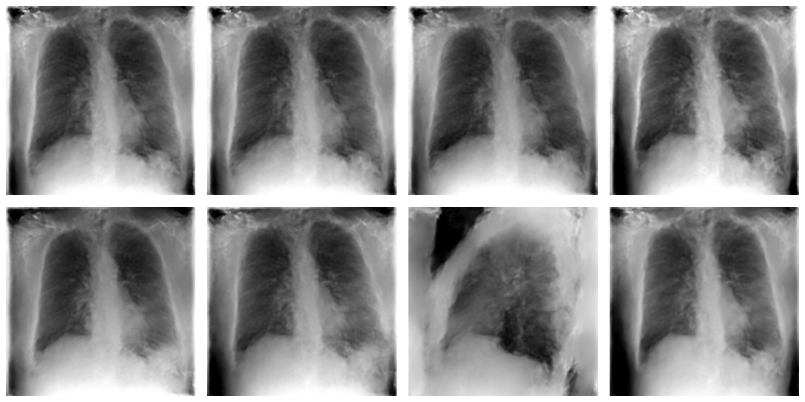

# PadChest v2 image-generator evaluation

## Executive summary

This report evaluates the PadChest v2 hierarchical variational autoencoder
(HVAE) checkpoint stored at:

```text
gs://external-cxr-dataset/padchest/checkpoints_v2/padchest/
  image_model_padchest_v2_tpu_v6e1
```

The evaluation restores the final available Orbax checkpoint at step
`380950`, corresponding to epoch 95 in the training run. It evaluates prior
generation under controlled configurations of the six v2 context variables:

```text
age_group, sex, tb_status, projection, view_position, scanner
```

Each configuration generates eight stochastic 128 x 128 grayscale images. The
evaluation reports:

1. Training-time validation ELBO/NLL/KL from the saved training log.
2. Inference-time ELBO/NLL/KL diagnostics for each causal configuration.
3. Output intensity statistics and within-configuration sample diversity.
4. Visual inspection of generated samples and intervention panels.

The checkpoint is operational and produces recognizable chest-radiograph-like
images. Acquisition interventions are the most visually identifiable: the
lateral configuration produces a lateral-looking image, while PA and AP
produce frontal-looking images. TB-status, age-group, sex, and scanner
interventions do not yet demonstrate strong, clinically interpretable visual
effects in this small prior-sampling evaluation. The model should therefore be
treated as a working image mechanism and counterfactual-generation baseline,
not as a clinically validated TB image simulator.

## 1. Checkpoint and training configuration

The checkpoint metadata reports:

| Property | Value |
|---|---|
| Dataset | PadChest |
| Model | Hierarchical VAE |
| Input | 1-channel, 128 x 128 |
| Context dimension | 21 |
| Latent dimension | 16 |
| Conditional prior | Enabled |
| Likelihood | Diagonal discretized Gaussian |
| Encoder | `128b3d2,64b3d4,16b3d4,4b3d4,1b4` |
| Decoder | `1b4,4b4,16b4,64b4,128b4` |
| Widths | `16, 32, 64, 128, 256` |
| Optimizer learning rate | `5e-4` |
| Weight decay | `0.01` |
| Batch size | `32` |
| Training precision | `bf16` |
| EMA rate | `0.999` |
| Training seed | `7` |
| TPU | v6e-1 |
| Training epochs | `100` |
| Final checkpoint used | step `380950` |

The checkpoint tree is approximately 328 MB and includes checkpoints at steps
60150 through 380950, `hparams.json`, a training log, and TensorBoard events.
The final step was selected because it is the last complete checkpoint and is
also the best validation-ELBO region in the saved log.

## 2. Causal context and intervention semantics

The v2 context has the following one-hot/scalar encoding:

| Variable | Encoded dimension | Categories or interpretation |
|---|---:|---|
| `age_group` | 5 | `0-4`, `5-17`, `18-39`, `40-64`, `65+` |
| `sex` | 2 | `non_m_or_unknown`, `M` |
| `tb_status` | 1 | `0 = negative`, `1 = TB or sequelae` according to the configured label mode |
| `projection` | 5 | `PA`, `AP`, `AP_horizontal`, `L`, `COSTAL` |
| `view_position` | 6 | `POSTEROANTERIOR`, `ANTEROPOSTERIOR`, `LATERAL`, `AP`, `PA`, `OTHER` |
| `scanner` | 2 | `ImagingDynamicsCompanyLtd`, `PhilipsMedicalSystems` |

The declared SCM edges are:

```text
age_group ──▶ tb_status
sex       ──▶ tb_status
```

All six variables condition the image mechanism. In the present evaluation,
each intervention changes the requested image context directly while the
latent sampling seed remains fixed. This is a controlled conditional-prior
comparison, not a paired factual/counterfactual evaluation because no original
input image is supplied to the prior-generation path.

## 3. Training-time quantitative performance

The training log contains validation measurements every five epochs. The
validation objective improved from `valid nelbo=2.2518` at epoch 10 to
`valid nelbo=1.9730` at epoch 95. The final epoch has the same rounded ELBO but
a slightly higher NLL (`1.4259` versus `1.4243`), so the final checkpoint should
not be described as strictly better than epoch 95 on every component.

| Checkpoint | Epoch | Validation NELBO | Validation NLL | Validation KL |
|---|---:|---:|---:|---:|
| First logged validation | 10 | 2.2518 | 1.9093 | 0.3425 |
| Mid-training | 50 | 2.0048 | 1.4659 | 0.5389 |
| Best rounded NELBO | 95 | 1.9730 | 1.4243 | 0.5487 |
| Final training epoch | 100 | 1.9730 | 1.4259 | 0.5471 |

The training log also contains several isolated numerical spikes in the
reported training KL/NELBO at epochs 11, 21, 52, and 74. The neighboring
epochs return to the normal range and validation remains stable. These spikes
should be retained in the experiment record; they should not be silently
removed when the training curve is plotted.

## 4. Prior-generation quantitative evaluation

### 4.1 Evaluation protocol

For every configuration:

- Restore EMA parameters from checkpoint step `380950`.
- Use the same seed (`20260930`) and eight stochastic samples.
- Use a zero-image diagnostic input only to compute the model ELBO terms.
- Generate images with latent temperature `1.0`, except the explicit
  temperature comparison.
- Keep unspecified context variables at the baseline values:
  `age_group=18-39`, `sex=non_m_or_unknown`, `tb_status=0`,
  `projection=PA`, `view_position=POSTEROANTERIOR`, and
  `scanner=ImagingDynamicsCompanyLtd`.

The inference ELBO is a diagnostic of the model response to a zero image. It
is not a held-out test-set reconstruction score. Lower is better for all three
terms shown below.

### 4.2 Causal-variable configurations

| Configuration | Intervention | ELBO | NLL | KL |
|---|---|---:|---:|---:|
| Baseline | 18-39, non-M/unknown, TB−, PA, posteroanterior, Imaging Dynamics | 0.4873 | 0.2612 | 0.2261 |
| TB positive | `tb_status: 0 → 1` | 0.4975 | 0.2735 | 0.2240 |
| Male | `sex: non-M/unknown → M` | 0.4829 | 0.2563 | 0.2266 |
| Age 0–4 | `age_group: 18-39 → 0-4` | 0.5058 | 0.2611 | 0.2446 |
| Age 65+ | `age_group: 18-39 → 65+` | 0.4901 | 0.2627 | 0.2274 |
| AP frontal | `projection/view: PA/posteroanterior → AP/anteroposterior` | 0.5454 | 0.3451 | 0.2003 |
| Lateral | `projection/view: PA/posteroanterior → L/ lateral` | 0.4447 | 0.2496 | 0.1951 |
| Philips scanner | `scanner: Imaging Dynamics → Philips` | 0.4030 | 0.1746 | 0.2284 |

The largest ELBO increase occurs for AP frontal imaging, while the lateral and
Philips configurations have lower ELBO. These differences indicate that the
decoder responds to the context, but they do not establish that the response
is clinically correct. In particular, the zero-image diagnostic input is not a
substitute for an observed-image reconstruction benchmark.

### 4.3 Image statistics and diversity

The generated PNGs were converted to grayscale values in `[0, 1]`. The mean
per-image standard deviation measures spatial contrast. Pairwise MAE is the
mean absolute difference between all pairs of generated images within a
configuration and is used as a simple diversity diagnostic.

| Configuration | Mean intensity | Mean spatial std | Pairwise MAE |
|---|---:|---:|---:|
| Baseline | 0.4810 | 0.2419 | 0.1520 |
| TB positive | 0.4800 | 0.2406 | 0.1554 |
| Male | 0.4737 | 0.2337 | 0.1363 |
| Age 0–4 | 0.4550 | 0.2582 | 0.1869 |
| Age 65+ | 0.4877 | 0.2416 | 0.1523 |
| AP frontal | 0.4578 | 0.2209 | 0.1792 |
| Lateral | 0.4238 | 0.2937 | 0.2322 |
| Philips scanner | 0.4769 | 0.2345 | 0.1555 |
| Temperature 0.7 | 0.4795 | 0.2452 | 0.1177 |
| Temperature 1.3 | 0.4820 | 0.2414 | 0.1860 |

The temperature control behaves as expected: temperature `0.7` reduces sample
diversity, while `1.3` increases it relative to the baseline. The lateral
configuration has the highest within-condition diversity and contrast, which
is consistent with a visibly different projection but should be confirmed on a
larger sample set.

## 5. Qualitative evaluation

### 5.1 Intervention panel

The panel shows one generated image from each causal configuration. The panel
is arranged left-to-right, top-to-bottom as: baseline, TB positive, male, age
0–4, age 65+, AP, lateral, and Philips.



**Figure 1. PadChest v2 causal-intervention samples.** One stochastic sample
from the same checkpoint and latent seed protocol is shown for each requested
context. The baseline is an adult 18–39-year-old, non-M/unknown-sex,
TB-negative PA/posteroanterior image from the Imaging Dynamics scanner
category. The other panels change one context variable or the paired
projection/view setting relative to that baseline: TB status, sex, age group,
AP frontal projection, lateral projection, or scanner category. These are
generated prior samples, not paired patient images; visual differences should
not be interpreted as proof of causal or clinical fidelity.

| Panel position | Configuration |
|---|---|
| Top-left | Baseline: age 18–39, non-M/unknown, TB−, PA/posteroanterior, Imaging Dynamics |
| Top, second | TB positive/sequelae: `tb_status=1` |
| Top, third | Male: `sex=M` |
| Top-right | Age 0–4: `age_group=0` |
| Bottom-left | Age 65+: `age_group=4` |
| Bottom, second | AP frontal: `projection=AP`, `view_position=ANTEROPOSTERIOR` |
| Bottom, third | Lateral: `projection=L`, `view_position=LATERAL` |
| Bottom-right | Philips scanner: `scanner=PhilipsMedicalSystems` |

The images preserve broad chest-radiograph structure: bilateral lung fields,
the mediastinal region, the diaphragm/lower thorax, and the expected grayscale
intensity organization. The AP and lateral outputs show the clearest change in
projection geometry. The TB, sex, and age changes are visually subtle and are
not sufficient to claim that the model reliably inserts or removes TB
pathology.

### 5.2 Latent-temperature panel


**Figure 2. Effect of latent sampling temperature.** Samples are generated
with the same baseline causal context while varying only the HVAE latent
temperature: `0.7` (left), `1.0` (center), and `1.3` (right). Lower temperature
reduces stochastic variation and higher temperature increases it; temperature
does not represent an intervention on age, sex, TB status, projection, view,
or scanner.

The temperature panel compares the same baseline context at temperatures
`0.7`, `1.0`, and `1.3`. Lower temperature produces more conservative and
similar samples; higher temperature introduces more visible variation. The
temperature changes the stochastic latent draw, not the causal parent vector.

### 5.3 Stored sample galleries

Every configuration contains eight generated PNGs and an `inference.json`
summary:

- [Baseline](artifacts/padchest_v2_eval/baseline/)
- [TB positive](artifacts/padchest_v2_eval/tb_positive/)
- [Male](artifacts/padchest_v2_eval/male/)
- [Age 0–4](artifacts/padchest_v2_eval/age_0_4/)
- [Age 65+](artifacts/padchest_v2_eval/age_65_plus/)
- [AP frontal](artifacts/padchest_v2_eval/ap/)
- [Lateral](artifacts/padchest_v2_eval/lateral/)
- [Philips scanner](artifacts/padchest_v2_eval/philips/)
- [Temperature 0.7](artifacts/padchest_v2_eval/temp_0_7/)
- [Temperature 1.3](artifacts/padchest_v2_eval/temp_1_3/)

## 6. Interpretation for counterfactual TB research

The current evidence supports three conclusions.

First, the image mechanism is usable for controlled generation. The outputs
are nonconstant, structurally recognizable radiographs, and the model responds
to acquisition variables. This makes it suitable for early stress-testing of a
TB classifier against view and scanner changes.

Second, acquisition variables are currently better supported than disease
variables. The PA/AP/lateral differences are visually apparent and have a
clear radiographic interpretation. TB status is a weak label in this model:
`tb_status=1` represents the configured `tb_or_sequelae` label mode, so it may
mix active disease, prior disease, and residual changes. A generated image
conditioned on TB positive should not be interpreted as an active-TB image
without an independent TB detector or radiologist review.

Third, demographic variables should be interpreted as conditional strata, not
literal anatomical interventions. Changing `sex` or `age_group` does not
create a scientifically clean individual-level counterfactual. It evaluates
whether the learned image distribution changes across the corresponding
training strata. For fairness and domain-robustness experiments, this is still
useful, but the language should be “conditional generation under a demographic
stratum” rather than “changing the patient’s sex or age.”

## 7. Reproducibility

The v2 inference encoder was added to
`src/training/inference.py` because the existing helper supported the older
17-dimensional PadChest context but not the 21-dimensional v2 checkpoint.
The evaluation configuration is:

[padchest_inference_v2_eval.yaml](../configs/padchest_inference_v2_eval.yaml)

The baseline command was:

```bash
JAX_PLATFORMS=cpu \
XLA_PYTHON_CLIENT_PREALLOCATE=false \
PYTHONPATH=src python scripts/run.py infer \
  --config configs/padchest_inference_v2_eval.yaml
```

An intervention was run by overriding the named parent and output directory,
for example:

```bash
PYTHONPATH=src python scripts/run.py infer \
  --config configs/padchest_inference_v2_eval.yaml \
  workflow.parents.tb_status=1 \
  workflow.output_dir=journal/artifacts/padchest_v2_eval/tb_positive
```

The source checkpoint is immutable for this evaluation. Temporary local copies
were used only to restore the Orbax tree; the generated evaluation artifacts
and this report are stored in the repository under
`causal-genx/journal/artifacts/padchest_v2_eval/`.

## 8. Limitations

- The inference ELBO/NLL/KL values are zero-image prior diagnostics, not
  held-out reconstruction performance.
- No FID, KID, LPIPS, SSIM, PSNR, radiologist score, or pathology-classifier
  agreement was computed in this run.
- Only eight samples were generated per configuration.
- The evaluation uses a single seed and therefore cannot estimate uncertainty
  over seeds.
- `tb_status` uses a weak `tb_or_sequelae` label and is not equivalent to
  microbiology-confirmed active pulmonary TB.
- The generated samples are not paired factual/counterfactual images, so
  intervention effects cannot be isolated at the individual-patient level.
- The model is trained at 128 x 128 resolution, which limits assessment of
  subtle lesions and small cavities.
- Visual plausibility was assessed informally and requires radiologist review
  before any medical interpretation.

## 9. Recommended next evaluation

The next evaluation should use a held-out PadChest split with observed images
and the following additions:

1. Compute reconstruction NLL, PSNR, SSIM, and LPIPS for each context stratum.
2. Train or apply an independent PadChest attribute predictor and measure
   whether generated images recover the requested age, sex, TB, projection,
   view, and scanner labels.
3. Compare factual and intervened outputs using paired latent seeds so that
   the effect of each intervention can be estimated with common random
   numbers.
4. Report 100 or more seeds per intervention and bootstrap confidence
   intervals for pixel diversity and attribute agreement.
5. Add a TB-specific external evaluator trained or validated on CXR-RAIT,
   Shenzhen, Montgomery, or another independently labeled TB dataset.
6. Require radiologist review of a stratified sample, especially for
   `tb_status=1`, AP, lateral, and scanner interventions.
7. Only after image fidelity is established, evaluate whether generated
   counterfactuals improve CXR-RAIT TB-classifier calibration, subgroup
   robustness, and external-domain performance.

## Bottom line

The PadChest v2 checkpoint is a viable starting image generator for causal
stress testing. Its strongest demonstrated behavior is conditional control of
projection/view and latent diversity. Its disease and demographic controls
remain insufficiently validated for claiming clinically faithful TB
counterfactuals. The next research milestone should therefore be
attribute-predictor agreement and held-out reconstruction evaluation before
using generated images as TB-classifier training data.
