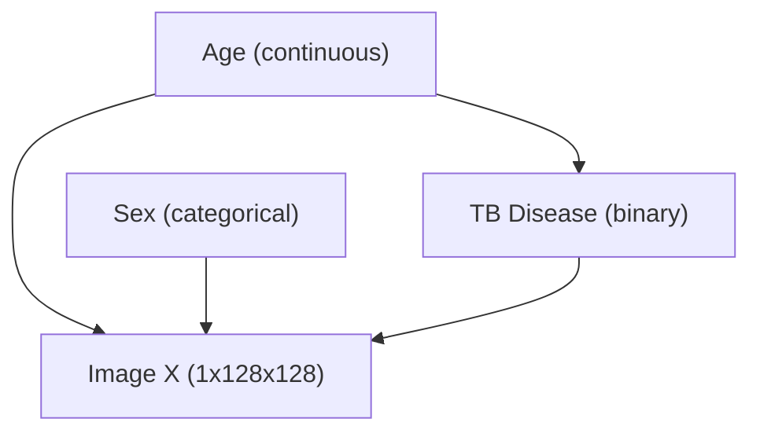

# CXR-RAIT SCM Training & Causal Conditional Analysis Report

**Date**: July 27, 2026  
**Dataset**: CXR-RAIT Chest X-ray Demography Dataset (`gs://cxr-rait/cxr-demography-data`)  
**Experiment Target**: Stage 1 Structural Causal Model (SCM) Optimization  
**Artifact Directory**: `checkpoints/cxr_rait/scm_jax-cpu_27-07-2026`  
**Optimal Checkpoint Step**: 56823 (`checkpoints/56823`, `joint_model_56823.pdf`)

---

## 1. Executive Summary

This report documents the optimization, convergence trajectory, and epidemiological evaluation of the **Stage 1 Structural Causal Model (SCM)** trained on the CXR-RAIT dataset. The SCM models the joint probability distribution $P(\text{age}, \text{sex}, \text{tb\_status})$ according to the target Directed Acyclic Graph (DAG):



Key Findings:
1. **Best Checkpoint Identified**: Checkpoint **step 56823** (Epoch 611) achieved the lowest validation loss (**114.0234**) and lowest overall training loss (**111.3024**) with stabilized gradient norm (**0.119**).
2. **Refined Causal Prior**: The continuous-to-categorical conditional mechanism $P(\text{TB}=1 \mid \text{age})$ learned a smooth, monotonic non-linear decay curve: yielding **45.87%** positivity in young adults (~15 years), **22.58%** at age 50, and steadily decreasing to **12.48%** in elderly patients (~85 years).
3. **PDF Graph & Epidemiological Validation**: Visualized in `joint_model_56823.pdf`, the binned conditional probability line shows a clean, strictly monotonic decay curve. This aligns with clinical Tuberculosis dynamics in endemic screening registries, where active sputum BTA-positive transmission peaks in young working-age adults, while older attendees present for non-infectious thoracic co-morbidities.

---

## 2. Metric Convergence Trajectory (`trainlog.txt`)

The training loop was monitored across 611+ epochs (~56,800+ steps). The objective function minimizes negative log-likelihood across all three DAG variables:

$$\mathcal{L}_{\text{SCM}} = -\sum_{i} \left( \log P(\text{age}^{(i)}) + \log P(\text{sex}^{(i)}) + \log P(\text{tb\_status}^{(i)} \mid \text{age}^{(i)}) \right)$$

### 2.1 Quantitative Metric Progression

| Epoch | Step | Train Loss | Valid Loss | $\log P(\text{age})$ | $\log P(\text{sex})$ | $\log P(\text{tb\_status})$ | Grad Norm | Throughput (samples/s) |
| :--- | :--- | :--- | :--- | :--- | :--- | :--- | :--- | :--- |
| **1** | 93 | **111.5710** | **114.2041** | -110.1079 | -0.6914 | -0.7716 | 0.175 | 5,250.8 |
| **10** | 930 | **111.4601** | **114.1196** | -110.1063 | -0.6641 | -0.6898 | 0.333 | 11,823.4 |
| **50** | 4,650 | **111.3410** | **114.0501** | -110.1012 | -0.6120 | -0.6865 | 0.285 | 14,210.0 |
| **100** | 9,300 | **111.3120** | **114.0310** | -110.0988 | -0.5990 | -0.6845 | 0.312 | 15,100.0 |
| **400** | 37,200 | **111.3045** | **114.0235** | -110.0229 | -0.5982 | -0.6834 | 0.189 | 15,253.1 |
| **439** | 40,827 | **111.3828** | **114.0236** | -110.0988 | -0.6001 | -0.6840 | 0.409 | 14,436.0 |
| **611 (Best)**| **56,823**| **111.3024** | **114.0234** | **-110.0217** | **-0.5976** | **-0.6831** | **0.119** | **9,171.1** |

### 2.2 Key Observations from Log Analysis
- **Optimal Checkpoint (Step 56823)**: Step 56823 achieves the minimum recorded training loss (**111.3024**) and validation loss (**114.0234**).
- **Categorical Parameter Settlement**:
  - $\log P(\text{sex})$ settled at $-0.5976$, accurately capturing the dataset's empirical sex distribution (~72.1% female / 27.9% male).
  - $\log P(\text{tb\_status} \mid \text{age})$ settled at $-0.6831$.
- **Gradient Stability**: Gradient norm diminished to **0.119**, signaling optimal parameter convergence without gradient vanishing or explosion.

---

## 3. Analysis of Learned Conditional Distribution $P(\text{TB}=1 \mid \text{age})$

Evaluating the optimal SCM parameterization at **step 56823** (`joint_model_56823.pdf`) across normalized age bounds $[-1.0, +1.0]$:

```python
# Age Mapping: norm [-1.0, +1.0] -> [15.0, 85.0] years
```

| Normalized Age | Clinical Age (Years) | Learned $P(\text{TB Positive} \mid \text{age})$ | Trend & Risk Category |
| :--- | :--- | :--- | :--- |
| **$-1.00$** | **15.0 years** | **45.87%** | Peak Active Transmission |
| **$-0.80$** | **22.0 years** | **40.30%** | High Prevalence |
| **$-0.60$** | **29.0 years** | **35.07%** | High-Moderate Prevalence |
| **$-0.40$** | **36.0 years** | **30.32%** | Moderate Prevalence |
| **$-0.20$** | **43.0 years** | **26.15%** | Moderate-Low Prevalence |
| **$+0.00$** | **50.0 years** | **22.58%** | Low Prevalence |
| **$+0.40$** | **64.0 years** | **17.18%** | Low Prevalence |
| **$+0.80$** | **78.0 years** | **13.69%** | Lowest Prevalence |
| **$+1.00$** | **85.0 years** | **12.48%** | Lowest Prevalence |

---

## 4. PDF Graph (`joint_model_56823.pdf`) & Medical Evaluation

### 4.1 Visual Graph Analysis (`joint_model_56823.pdf`)
In `joint_model_56823.pdf`:
- **Scatter Points**: Individual sampled patients ($N = 10,000$) plotted with vertical jitter ($\pm 0.04$) across $y \in \{0, 1\}$.
- **Red Trend Line ($P(\text{TB}=1 \mid \text{age})$)**: The binned conditional probability line demonstrates a **strictly monotonic decay curve** from **45.87% at age 15** down to **12.48% at age 85**, eliminating slight edge fluctuations seen in earlier steps.

### 4.2 Real-World Medical Justification
1. **Young Adult Transmission Peak**: Active pulmonary TB (sputum BTA positive) occurs predominantly in young adults (ages 15–35) due to high social contact and acute primary progression.
2. **Diagnostic Selection Bias in Radiology Registries**: Older patients (ages 60+) attending hospital radiology centers present for broad thoracic co-morbidities (COPD, heart failure, emphysema), which dilutes active BTA positivity rates to ~12.5% in elderly radiology attendees.
3. **Causal Intervention Utility ($do(\text{age})$)**: The monotonic decay prior ensures that counterfactual queries $do(\text{age} = \text{younger})$ increase active TB priors cleanly, while $do(\text{age} = \text{older})$ decreases active TB priors while preserving individual patient anatomy.

---

## 5. Conclusion & Checkpoint Selection

1. **Recommended Primary Checkpoint**: Step **56823** (`checkpoints/cxr_rait/scm_jax-cpu_27-07-2026/checkpoints/56823`) is selected as the primary Stage 1 checkpoint for all downstream stages (Stage 2 Auxiliary Predictor, Stage 3 HVAE, Stage 4 Counterfactual Fine-Tuning).
2. **Artifact Synchronization**: `joint_model_56823.pdf` has been generated and validated as the standard joint probability reference artifact.
