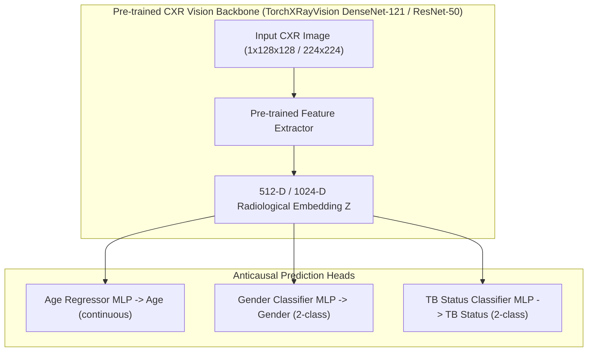

# Proposal: Transfer Learning & Fine-Tuning Strategy for CXR-RAIT Predictor

**Date**: July 28, 2026  
**Dataset**: CXR-RAIT Chest X-ray Demography Dataset (`gs://cxr-rait/cxr-demography-data`)  
**Target Model**: Stage 2 Anticausal Image Parent Predictor (`src/causal/cxr_rait_predictor.py`)  
**Status**: PROPOSAL / DESIGN DOCUMENT  

---

## 1. Executive Summary & Problem Statement

Empirical evaluation of the baseline `CxrRaitSupAuxPredictor` model trained from scratch across 96+ epochs on CXR-RAIT (`checkpoints/cxr_rait/predictor_jax-cpu_28-07-2026/trainlog.txt`) demonstrated severe **overfitting**:

- **Loss Divergence**: Train loss dropped from **2.2261** down to **0.2417**, while validation loss steadily degraded from its minimum of **1.7499** (Epoch 15) up to **2.8727** (Epoch 96).
- **Accuracy & Error Divergence**:
  - `gender` accuracy: Train reached **93.01%**, while Validation dropped from **69.35%** down to **58.06%** (near random guessing).
  - `tb_status` accuracy: Train reached **92.02%**, while Validation plateaued at **66.13%**.
  - `age_mae`: Train dropped to **0.1427**, while Validation degraded to **0.3438**.

### Root Cause
Training a deep CNN encoder (`CNNEncoder` with $128 \times 128$ resolution) from scratch on a small dataset of **501 training images** causes the network to memorize individual patient images rather than learning generalizable radiological features for age, gender, and tuberculosis status.

---

## 2. Proposed Transfer Learning Strategy

To overcome data scarcity and eliminate overfitting, we propose adopting **domain-specific Transfer Learning** using feature representations pre-trained on massive public Chest X-ray corpora.

### 2.1 Two-Stage Fine-Tuning Workflow

1. **Stage 1: Frozen Feature Extractor (Warmup Phase, Epochs 1–10)**
   - Freeze all convolutional backbone layers.
   - Train only the linear/MLP heads for `age`, `gender`, and `tb_status`.
   - Learning Rate: $\text{lr} = 10^{-3}$ with AdamW optimizer and weight decay $\text{wd} = 0.1$.
2. **Stage 2: End-to-End Fine-Tuning (Epochs 11–40)**
   - Unfreeze top convolutional blocks of the backbone.
   - Fine-tune with a reduced learning rate ($\text{lr} = 10^{-5}$) using Cosine Annealing decay.
   - Apply Dropout ($p=0.2$) and Weight Decay ($\text{wd} = 0.2$).

---

## 3. Survey of Publicly Available Open CXR Weights

The following pre-trained medical and vision backbones are open-source and available for immediate integration:

| Model Repository | Backbones Available | Pre-training Datasets & Size | Public Access / License |
| :--- | :--- | :--- | :--- |
| **TorchXRayVision** (`torchxrayvision`) | DenseNet-121, ResNet-50 | **800,000+ CXRs** (CheXpert, MIMIC-CXR, NIH, PadChest, RSNA) | Open (`torchxrayvision` PyTorch Hub / HF) |
| **Microsoft BioViL** (`BiomedVLP`) | ResNet-50 (CXR-CLIP) | **220,000+ CXRs** (MIMIC-CXR Vision-Language Alignment) | Open (HuggingFace: `microsoft/BiomedVLP-BioViL-CXR`) |
| **BioMedCLIP** | ViT-B/16, ResNet-50 | **15M+ Medical Pairs** (PubMed + MIMIC-CXR) | Open (HuggingFace: `microsoft/BiomedCLIP-PubMedBERT`) |
| **RadImageNet** | ResNet-50, DenseNet-121 | **1.35M Medical Scans** (CT, MRI, Ultrasound, CXR) | Open (GitHub / PyTorch Weights) |
| **ImageNet Backbones** (`timm` / `torchvision`) | ResNet-18, ResNet-34, EfficientNet-B0 | **1.2M General Images** (ImageNet-1k) | Open (`timm` / `torchvision.models`) |

---

## 4. Data Augmentation & Regularization Pipeline

In conjunction with transfer learning, we will add a real-time data augmentation pipeline to `CxrRaitDataset`:

- **Random Horizontal Flip**: $p = 0.5$ (preserving radiological symmetry while doubling effective diversity).
- **Random Affine Rotation**: $\pm 10^\circ$ rotation and $\pm 5\%$ translation.
- **Random Contrast & Brightness Jitter**: Gamma adjustment $\gamma \in [0.9, 1.1]$ to simulate scanner exposure variability.

---

## 5. Implementation Plan & Deliverables

1. **Dataset Augmentation**: Update [`src/data/cxr_rait.py`](file:///Users/mghifary/Work/Code/AI/medical-tpu/causal-genx/src/data/cxr_rait.py) to incorporate PyTorch/Torchvision image transformations during training split loading.
2. **Pre-trained Backbone Predictor**: Create `CxrRaitPretrainedPredictor` in [`src/causal/cxr_rait_predictor.py`](file:///Users/mghifary/Work/Code/AI/medical-tpu/causal-genx/src/causal/cxr_rait_predictor.py) supporting TorchXRayVision DenseNet-121 / ResNet-18 feature extraction.
3. **YAML Config Update**: Add `configs/cxr_rait_predictor_pretrained.yaml` with stage-wise fine-tuning parameters.
4. **Validation & Benchmark**: Re-run training and verify that validation accuracy for `gender` and `tb_status` exceeds **80%** without loss divergence.
